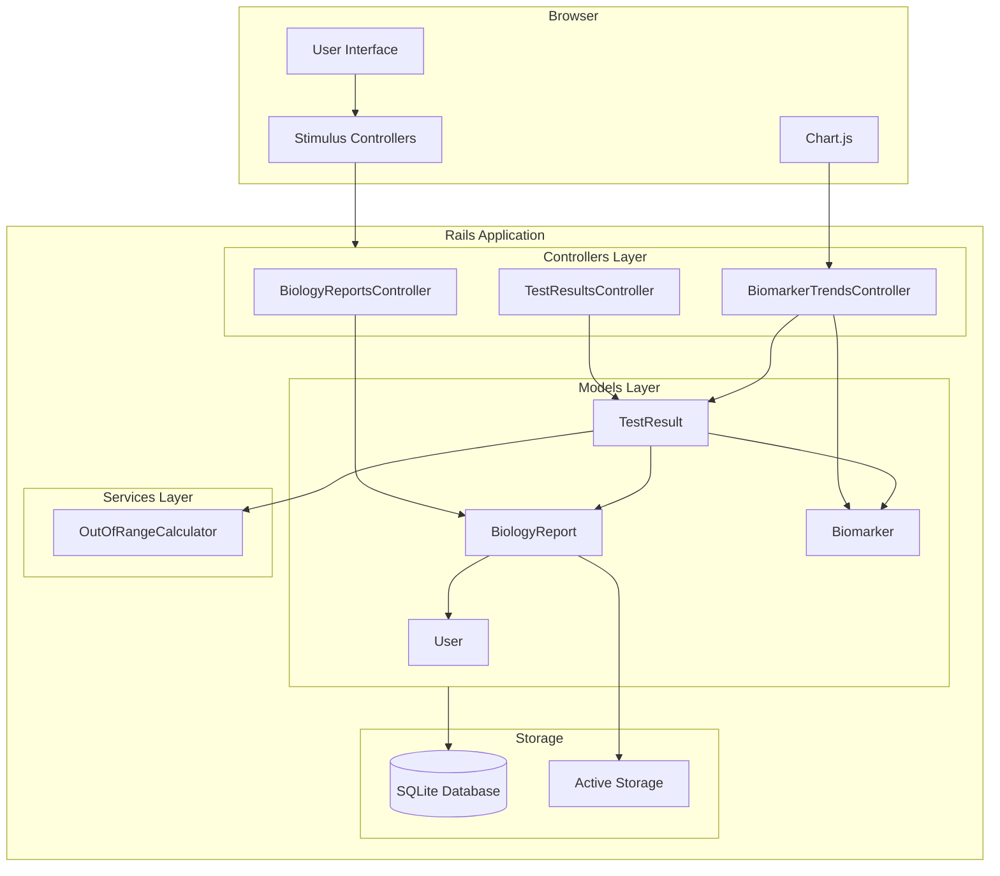
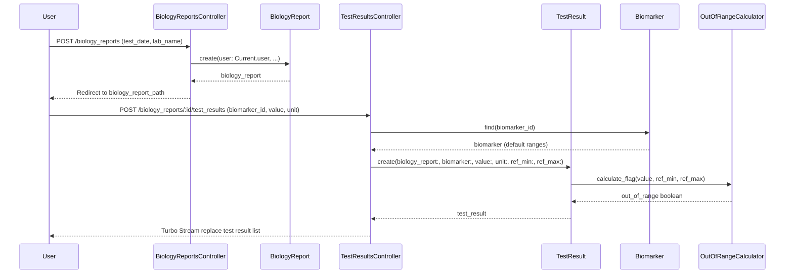
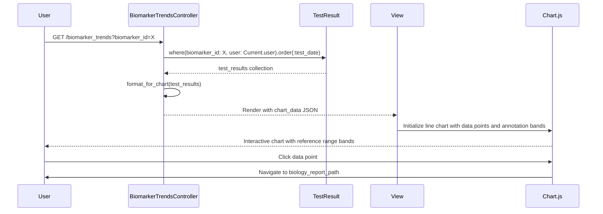

# Technical Design Document: Biology Reports

## Overview

This feature enables authenticated users to store, manage, and visualize biology/lab test results over time within the Avicen personal health management application. Users can manually enter lab report data, attach original documents, view out-of-range values flagged automatically, and see biomarker trends through interactive charts.

**Purpose**: Provide comprehensive lab result tracking with trend visualization to help users understand health trends and treatment impacts.

**Users**: Authenticated Avicen users will utilize this for recording lab work history, monitoring biomarker changes over time, and maintaining source documents alongside structured data.

**Impact**: Introduces a new health data domain (biology reports) on top of the existing authentication and user profile foundation. Creates new models for biomarker catalog, biology reports, and test results; integrates Active Storage for document attachments; adds Chart.js for trend visualization; and extends Turbo Frame patterns for filtering.

### Goals
- Enable complete lab report history management with CRUD operations
- Provide biomarker catalog with auto-fill reference ranges
- Flag out-of-range test results automatically
- Visualize biomarker trends over time with interactive charts
- Support document attachment for original lab reports
- Implement search and filtering for efficient report access

### Non-Goals
- OCR or automated parsing of lab report documents (future enhancement)
- Multi-user access or report sharing with healthcare providers (future enhancement)
- Export functionality for reports or test results (future enhancement)
- Biomarker category/grouping by organ system (future enhancement)
- Historical tracking of reference range changes over time (future enhancement)
- Integration with external lab systems or APIs (future enhancement)

## Architecture

### Existing Architecture Analysis

The Avicen application follows standard Rails 8.1 MVC patterns with Hotwire (Turbo + Stimulus) for progressive enhancement. Key patterns to extend:

- **User Scoping**: All resources scoped through `Current.user` with session-based authentication
- **Service Objects**: Complex business logic in `app/services/` with Result pattern
- **Turbo Frames**: Partial page updates without full reload
- **Active Storage**: File attachments with local disk storage
- **Stimulus Controllers**: Client-side interactivity patterns already established
- **stimulus-autocomplete**: Already integrated for drug search (medication feature)

### Architecture Pattern & Boundary Map

**Selected Pattern**: Rails MVC with Domain-Driven Design boundaries

The biology reports feature introduces a new health data subdomain alongside the existing medication management domain. The architecture maintains clear separation between domains while sharing common infrastructure (authentication, user model, Turbo/Stimulus patterns).



**Architecture Integration**:
- **Selected pattern**: Rails MVC with service objects for complex calculations
- **Domain boundaries**: Biology Reports domain is isolated from Medication domain; both share User model and authentication infrastructure
- **Existing patterns preserved**: User scoping via `Current.user`, Turbo Frame updates, stimulus-autocomplete for biomarker search, Active Storage for document attachments
- **New components rationale**: BiologyReport and TestResult models represent new domain entities; Biomarker catalog provides reference data; Chart.js enables rich trend visualization not achievable with CSS alone
- **Steering compliance**: Follows Rails 8 conventions (importmap, Hotwire, session auth), lean models with service extraction for calculations, RESTful controllers, Minitest testing

### Technology Stack

| Layer | Choice / Version | Role in Feature | Notes |
|-------|------------------|-----------------|-------|
| **Frontend / UI** | Hotwire Turbo + Stimulus | Progressive enhancement, Turbo Frame filtering | Existing stack |
| **Frontend / UI** | Chart.js 4.4.1 | Line chart rendering with reference bands | New dependency via importmap |
| **Frontend / UI** | chartjs-plugin-annotation 3.x | Reference range visualization as shaded regions | New dependency via importmap |
| **Frontend / UI** | stimulus-autocomplete 3.1.0 | Biomarker search autocomplete | Already integrated |
| **Backend / Services** | Rails 8.1 | MVC framework, RESTful controllers | Existing stack |
| **Backend / Services** | Active Storage | Document attachment (PDF, JPEG, PNG) | Already configured |
| **Data / Storage** | SQLite3 | Relational database for models | Existing stack |
| **Data / Storage** | Active Record | ORM with validations, associations, scopes | Existing stack |

## System Flows

### Biology Report Creation with Test Results



**Key Decisions**:
- Biology report creation is separate from test result entry to support incomplete data entry workflows
- Out-of-range calculation happens on save/update to ensure consistency
- Turbo Streams update the test result list without full page reload
- Reference ranges can be auto-filled from Biomarker catalog or manually overridden

### Biomarker Trend Visualization



**Key Decisions**:
- Chart data prepared server-side as JSON for security and consistency
- Chart.js annotation plugin adds reference range bands as shaded regions
- Data points are clickable, navigating to source biology report
- When fewer than 2 data points exist, display table instead of chart

## Requirements Traceability

| Requirement | Summary | Components | Interfaces | Flows |
|-------------|---------|------------|------------|-------|
| 1.1, 1.2, 1.3, 1.4 | Biomarker catalog with autocomplete and auto-fill | Biomarker, BiomarkerSearchController, biomarker-search Stimulus | Service (search), API (search endpoint) | -- |
| 2.1, 2.2, 2.3, 2.4, 2.5, 2.6 | Biology report CRUD with user scoping | BiologyReport, BiologyReportsController | Service, API, State | Report creation flow |
| 3.1, 3.2, 3.3, 3.4, 3.5, 3.6 | Test result entry with out-of-range flagging | TestResult, TestResultsController, OutOfRangeCalculator | Service, State | Test result creation flow |
| 4.1, 4.2, 4.3, 4.4, 4.5 | Document attachment with validation | BiologyReport (Active Storage), DocumentValidator | -- | -- |
| 5.1, 5.2, 5.3, 5.4, 5.5 | Trend visualization with reference bands | BiomarkerTrendsController, biomarker-chart Stimulus, Chart.js | API (trend endpoint) | Trend visualization flow |
| 6.1, 6.2, 6.3, 6.4 | Search and filtering with Turbo Frames | BiologyReportsController (filter actions), filter-form Stimulus | -- | -- |
| 7.1, 7.2, 7.3, 7.4, 7.5 | Data integrity constraints and validations | BiologyReport, TestResult, Biomarker (validations, foreign keys) | -- | -- |

## Components and Interfaces

### Component Summary

| Component | Domain/Layer | Intent | Req Coverage | Key Dependencies (P0/P1) | Contracts |
|-----------|--------------|--------|--------------|--------------------------|-----------|
| Biomarker | Data / Model | Catalog of biomarkers with reference data | 1.1, 1.2, 1.3, 1.4, 7.2 | User (P0), TestResult (P1) | State |
| BiologyReport | Data / Model | Report metadata with document attachment | 2.1, 2.2, 2.3, 2.4, 2.5, 2.6, 4.1, 4.2, 4.3, 4.4, 4.5, 7.1, 7.5 | User (P0), TestResult (P1), Active Storage (P0) | State |
| TestResult | Data / Model | Individual test value with reference range and flag | 3.1, 3.2, 3.3, 3.4, 3.5, 3.6, 7.2, 7.3, 7.4, 7.5 | BiologyReport (P0), Biomarker (P0) | State |
| BiologyReportsController | Backend / Controller | CRUD and filtering for biology reports | 2.1, 2.2, 2.3, 2.4, 2.5, 2.6, 6.1, 6.2, 6.3 | BiologyReport (P0) | API |
| TestResultsController | Backend / Controller | Nested CRUD for test results | 3.1, 3.2, 3.3, 3.4, 3.5, 3.6 | TestResult (P0), Biomarker (P0) | API |
| BiomarkerSearchController | Backend / Controller | Autocomplete search endpoint | 1.2 | Biomarker (P0) | API |
| BiomarkerTrendsController | Backend / Controller | Trend data for charts | 5.1, 5.2, 5.4 | TestResult (P0), Biomarker (P0) | API |
| OutOfRangeCalculator | Backend / Service | Calculate out-of-range flag | 3.4, 3.6 | -- | Service |
| DocumentValidator | Backend / Service | Validate file type for attachments | 4.2, 4.5 | Active Storage (P0) | Service |
| biomarker-search Stimulus | Frontend / Controller | Autocomplete behavior for biomarker search | 1.2, 1.3 | stimulus-autocomplete (P0 External) | -- |
| biomarker-chart Stimulus | Frontend / Controller | Render Chart.js line charts | 5.1, 5.2, 5.3, 5.4 | Chart.js (P0 External), chartjs-plugin-annotation (P0 External) | -- |
| filter-form Stimulus | Frontend / Controller | Submit filters without page reload | 6.1, 6.2, 6.3 | Turbo (P0) | -- |

### Data / Models

#### Biomarker

| Field | Detail |
|-------|--------|
| Intent | Maintain catalog of common biomarkers with default reference ranges |
| Requirements | 1.1, 1.2, 1.3, 1.4, 7.2 |

**Responsibilities & Constraints**
- Provide searchable catalog of biomarkers with name, code, unit, and default reference ranges
- Support autocomplete search by name or code
- Validate uniqueness of biomarker codes
- Immutable after seeding (no user modifications to catalog)

**Dependencies**
- Inbound: TestResult — references biomarker (P1)
- Outbound: None

**Contracts**: State [X]

##### State Management
- **State model**: Persisted via Active Record with indexed search fields
- **Persistence**: SQLite database with `biomarkers` table
- **Consistency**: Seed data loaded on database setup; no user mutations

**Implementation Notes**
- **Integration**: Seed with 20-30 common biomarkers from LOINC-mapped lab tests (CBC, metabolic panel, lipid panel, thyroid, vitamin D, etc.)
- **Validation**: Uniqueness on code (case-insensitive), presence on name/unit/code, numeric ranges
- **Risks**: Reference ranges are population averages; users can override with lab-specific ranges

#### BiologyReport

| Field | Detail |
|-------|--------|
| Intent | Store lab report metadata with document attachment |
| Requirements | 2.1, 2.2, 2.3, 2.4, 2.5, 2.6, 4.1, 4.2, 4.3, 4.4, 4.5, 7.1, 7.5 |

**Responsibilities & Constraints**
- Belong to exactly one user (foreign key constraint)
- Store test date, laboratory name, optional notes
- Support single document attachment (PDF, JPEG, PNG) via Active Storage
- Cascade delete associated test results when deleted
- Validate test date presence

**Dependencies**
- Inbound: User — owns biology reports (P0)
- Inbound: TestResult — belongs to report (P1)
- External: Active Storage — document attachment (P0)

**Contracts**: State [X]

##### State Management
- **State model**: Active Record with `has_one_attached :document` for Active Storage integration
- **Persistence**: SQLite database with `biology_reports` table; files stored via Active Storage
- **Consistency**: Foreign key to users; cascade delete on test results (`dependent: :destroy`)
- **Concurrency strategy**: Optimistic locking not required (single-user resource)

**Implementation Notes**
- **Integration**: Extend existing user-scoped pattern (similar to prescriptions)
- **Validation**: Date presence, file type validation via custom validator (PDF, JPEG, PNG only)
- **Risks**: File uploads may fail; display error and preserve form data for retry

#### TestResult

| Field | Detail |
|-------|--------|
| Intent | Store individual test result with reference range and out-of-range flag |
| Requirements | 3.1, 3.2, 3.3, 3.4, 3.5, 3.6, 7.2, 7.3, 7.4, 7.5 |

**Responsibilities & Constraints**
- Belong to exactly one biology report and one biomarker (foreign key constraints)
- Store numeric value, unit, reference range min/max, out-of-range flag
- Recalculate out-of-range flag on save/update via callback
- Validate numeric value, presence of biomarker/value/unit
- Cascade delete when parent biology report is deleted

**Dependencies**
- Inbound: BiologyReport — owns test results (P0)
- Inbound: Biomarker — provides reference data (P0)
- Outbound: OutOfRangeCalculator — calculates flag (P0)

**Contracts**: State [X]

##### State Management
- **State model**: Active Record with calculated boolean flag (`out_of_range`)
- **Persistence**: SQLite database with `test_results` table
- **Consistency**: Foreign keys to biology_reports and biomarkers; cascade delete from parent
- **Concurrency strategy**: Optimistic locking not required (single-user, sequential entry)

**Implementation Notes**
- **Integration**: Use `before_save` callback to invoke OutOfRangeCalculator
- **Validation**: Numeric value, presence of required fields, foreign key constraints
- **Risks**: Reference range may be missing; default to nil flag and show warning

### Backend / Controllers

#### BiologyReportsController

| Field | Detail |
|-------|--------|
| Intent | RESTful CRUD for biology reports with filtering |
| Requirements | 2.1, 2.2, 2.3, 2.4, 2.5, 2.6, 6.1, 6.2, 6.3 |

**Responsibilities & Constraints**
- Scope all queries through `Current.user.biology_reports`
- Implement standard REST actions (index, show, new, create, edit, update, destroy)
- Support filtering by date range and laboratory name via query parameters
- Return Turbo Frame updates for filtered index
- Handle document attachment via nested attributes or separate upload action

**Dependencies**
- Inbound: User — authentication and scoping (P0)
- Outbound: BiologyReport — CRUD operations (P0)

**Contracts**: API [X]

##### API Contract

| Method | Endpoint | Request | Response | Errors |
|--------|----------|---------|----------|--------|
| GET | /biology_reports | Query params: date_from, date_to, lab_name | HTML (Turbo Frame) or full page | 401, 500 |
| GET | /biology_reports/:id | -- | HTML (full page) | 401, 404, 500 |
| GET | /biology_reports/new | -- | HTML form | 401, 500 |
| POST | /biology_reports | Form params: test_date, lab_name, notes | Redirect or Turbo Stream | 401, 422, 500 |
| GET | /biology_reports/:id/edit | -- | HTML form | 401, 404, 500 |
| PATCH | /biology_reports/:id | Form params: test_date, lab_name, notes | Redirect or Turbo Stream | 401, 404, 422, 500 |
| DELETE | /biology_reports/:id | -- | Redirect or Turbo Stream | 401, 404, 500 |

**Implementation Notes**
- **Integration**: Follow existing controller patterns (thin actions, user scoping, Turbo Stream responses)
- **Validation**: Strong parameters for biology_report attributes; handle validation errors with `status: :unprocessable_entity`
- **Risks**: Document upload may timeout; consider background processing for large files

#### TestResultsController

| Field | Detail |
|-------|--------|
| Intent | Nested CRUD for test results under biology reports |
| Requirements | 3.1, 3.2, 3.3, 3.4, 3.5, 3.6 |

**Responsibilities & Constraints**
- Nest routes under biology reports (`/biology_reports/:biology_report_id/test_results`)
- Scope queries through parent biology report (ensures user ownership)
- Auto-fill reference ranges from biomarker catalog when biomarker selected
- Recalculate out-of-range flag on save/update
- Return Turbo Stream updates for test result list

**Dependencies**
- Inbound: BiologyReport — parent resource (P0)
- Outbound: TestResult — CRUD operations (P0)
- Outbound: Biomarker — reference data lookup (P0)

**Contracts**: API [X]

##### API Contract

| Method | Endpoint | Request | Response | Errors |
|--------|----------|---------|----------|--------|
| GET | /biology_reports/:biology_report_id/test_results/new | Query param: biomarker_id (optional) | HTML form with auto-filled ranges | 401, 404, 500 |
| POST | /biology_reports/:biology_report_id/test_results | Form params: biomarker_id, value, unit, ref_min, ref_max | Turbo Stream replace test result list | 401, 404, 422, 500 |
| GET | /biology_reports/:biology_report_id/test_results/:id/edit | -- | HTML form | 401, 404, 500 |
| PATCH | /biology_reports/:biology_report_id/test_results/:id | Form params: value, unit, ref_min, ref_max | Turbo Stream replace test result item | 401, 404, 422, 500 |
| DELETE | /biology_reports/:biology_report_id/test_results/:id | -- | Turbo Stream remove test result item | 401, 404, 500 |

**Implementation Notes**
- **Integration**: Use `before_action` to load parent biology report; auto-fill ranges by fetching biomarker on form render
- **Validation**: Strong parameters; validate biomarker_id presence; handle missing biomarker gracefully
- **Risks**: User may override auto-filled ranges incorrectly; add confirmation UI for large deviations

#### BiomarkerSearchController

| Field | Detail |
|-------|--------|
| Intent | Autocomplete search endpoint for biomarkers |
| Requirements | 1.2 |

**Responsibilities & Constraints**
- Return HTML fragments (`<li>` elements) for stimulus-autocomplete
- Search biomarkers by name or code (case-insensitive)
- Limit results to top 10 matches
- Include biomarker ID, name, code, and default unit in data attributes
- No user scoping required (biomarker catalog is global)

**Dependencies**
- Outbound: Biomarker — search queries (P0)

**Contracts**: API [X]

##### API Contract

| Method | Endpoint | Request | Response | Errors |
|--------|----------|---------|----------|--------|
| GET | /biomarkers/search | Query param: q (search term) | HTML fragments (`<li role="option">`) | 500 |

**Implementation Notes**
- **Integration**: Follow existing drug search pattern (HTML fragments, not JSON)
- **Validation**: Return empty list if query < 2 characters
- **Risks**: Performance with 100+ biomarkers; add database indexes on name and code

#### BiomarkerTrendsController

| Field | Detail |
|-------|--------|
| Intent | Provide trend data for Chart.js line charts |
| Requirements | 5.1, 5.2, 5.4 |

**Responsibilities & Constraints**
- Fetch all test results for a given biomarker and current user
- Order by test date ascending
- Format as JSON with chart-compatible structure (labels, datasets, annotations)
- Include reference range for annotation plugin
- Return 404 if biomarker not found or no data exists

**Dependencies**
- Inbound: User — authentication and scoping (P0)
- Outbound: TestResult — query test results (P0)
- Outbound: Biomarker — reference range data (P0)

**Contracts**: API [X]

##### API Contract

| Method | Endpoint | Request | Response | Errors |
|--------|----------|---------|----------|--------|
| GET | /biomarker_trends/:biomarker_id | -- | HTML page with embedded JSON chart data | 401, 404, 500 |

Example response JSON structure (embedded in view):
```javascript
{
  labels: ["2025-01-15", "2025-02-10", "2025-03-05"],
  datasets: [{
    label: "Glucose (mg/dL)",
    data: [95, 102, 88],
    borderColor: "#3b82f6",
    backgroundColor: "rgba(59, 130, 246, 0.1)"
  }],
  annotations: {
    box1: {
      type: "box",
      yMin: 70,
      yMax: 100,
      backgroundColor: "rgba(34, 197, 94, 0.1)",
      borderColor: "rgba(34, 197, 94, 0.5)",
      label: { content: "Normal Range", enabled: true }
    }
  }
}
```

**Implementation Notes**
- **Integration**: Generate JSON server-side for security; pass to Stimulus controller via data attribute
- **Validation**: Handle edge cases (no data, single data point) by rendering table instead of chart
- **Risks**: Large datasets may slow chart rendering; paginate or limit to recent 50 results

### Backend / Services

#### OutOfRangeCalculator

| Field | Detail |
|-------|--------|
| Intent | Calculate out-of-range flag for test results |
| Requirements | 3.4, 3.6 |

**Responsibilities & Constraints**
- Compare test value against reference range (min/max)
- Return boolean flag (true if out of range, false if in range)
- Handle nil reference ranges gracefully (return nil flag)
- Stateless service method (no instance variables)

**Dependencies**
- None

**Contracts**: Service [X]

##### Service Interface

```ruby
class OutOfRangeCalculator
  # Calculate out-of-range flag
  #
  # @param value [Numeric] Test result value
  # @param ref_min [Numeric, nil] Minimum reference value
  # @param ref_max [Numeric, nil] Maximum reference value
  # @return [Boolean, nil] True if out of range, false if in range, nil if ranges not provided
  def self.call(value:, ref_min:, ref_max:)
    return nil if ref_min.nil? || ref_max.nil?
    value < ref_min || value > ref_max
  end
end
```

- **Preconditions**: Value must be numeric
- **Postconditions**: Returns boolean or nil
- **Invariants**: Deterministic for same inputs

**Implementation Notes**
- **Integration**: Invoke from TestResult `before_save` callback
- **Validation**: Check for nil values before comparison
- **Risks**: Edge case where value equals boundary (considered in range)

#### DocumentValidator

| Field | Detail |
|-------|--------|
| Intent | Validate file type for Active Storage attachments |
| Requirements | 4.2, 4.5 |

**Responsibilities & Constraints**
- Check attached file content type
- Reject files not matching allowed types (PDF, JPEG, PNG)
- Return validation error message on failure
- Integrate with Active Record validation lifecycle

**Dependencies**
- External: Active Storage — attachment API (P0)

**Contracts**: Service [X]

##### Service Interface

```ruby
class DocumentValidator < ActiveModel::Validator
  ALLOWED_TYPES = %w[application/pdf image/jpeg image/png].freeze

  def validate(record)
    return unless record.document.attached?

    unless ALLOWED_TYPES.include?(record.document.content_type)
      record.errors.add(:document, "must be a PDF, JPEG, or PNG file")
    end
  end
end
```

- **Preconditions**: Record has document attachment
- **Postconditions**: Adds validation error if type invalid
- **Invariants**: Allowed types constant

**Implementation Notes**
- **Integration**: Use as custom validator in BiologyReport model (`validates_with DocumentValidator`)
- **Validation**: Check content type from Active Storage blob
- **Risks**: Content type may be spoofed; consider content inspection for production

### Frontend / Controllers (Stimulus)

#### biomarker-search Stimulus

| Field | Detail |
|-------|--------|
| Intent | Autocomplete behavior for biomarker search input |
| Requirements | 1.2, 1.3 |

**Responsibilities & Constraints**
- Extend stimulus-autocomplete controller
- Configure with `/biomarkers/search` endpoint
- Handle autocomplete selection to populate form fields (biomarker ID, name, default unit, reference ranges)
- Minimum 2-character threshold for search activation

**Dependencies**
- External: stimulus-autocomplete 3.1.0 (P0)
- Outbound: BiomarkerSearchController — search endpoint (P0)

**Implementation Notes**
- **Integration**: Follow drug-search Stimulus controller pattern (extend Autocomplete class)
- **Validation**: Client-side minimum length enforced by stimulus-autocomplete
- **Risks**: None (leverages proven pattern)

#### biomarker-chart Stimulus

| Field | Detail |
|-------|--------|
| Intent | Render Chart.js line chart with reference range bands |
| Requirements | 5.1, 5.2, 5.3, 5.4 |

**Responsibilities & Constraints**
- Initialize Chart.js with line chart configuration
- Register chartjs-plugin-annotation for reference bands
- Parse chart data from data attribute (passed from server)
- Make data points clickable (navigate to biology report)
- Destroy chart on disconnect to prevent memory leaks

**Dependencies**
- External: Chart.js 4.4.1 (P0)
- External: chartjs-plugin-annotation 3.x (P0)

**Implementation Notes**
- **Integration**: Pin Chart.js and annotation plugin via importmap; register annotation plugin in Stimulus controller
- **Validation**: Handle missing data gracefully (show message instead of chart)
- **Risks**: Large datasets may slow rendering; limit to recent 50 data points

Example implementation structure:
```javascript
import { Controller } from "@hotwired/stimulus"
import Chart from "chart.js/auto"
import annotationPlugin from "chartjs-plugin-annotation"

Chart.register(annotationPlugin)

export default class extends Controller {
  static targets = ["canvas"]
  static values = { chartData: Object }

  connect() {
    this.chart = new Chart(this.canvasTarget, {
      type: "line",
      data: this.chartDataValue,
      options: {
        onClick: (event, elements) => {
          if (elements.length > 0) {
            // Navigate to biology report
          }
        },
        plugins: {
          annotation: {
            annotations: this.chartDataValue.annotations
          }
        }
      }
    })
  }

  disconnect() {
    if (this.chart) {
      this.chart.destroy()
    }
  }
}
```

#### filter-form Stimulus

| Field | Detail |
|-------|--------|
| Intent | Submit filter form via Turbo Frame without page reload |
| Requirements | 6.1, 6.2, 6.3 |

**Responsibilities & Constraints**
- Listen to form input changes (date range, lab name)
- Submit form automatically via Turbo Frame
- Update biology reports list without full page reload
- Preserve filter state in URL query parameters

**Dependencies**
- External: Turbo (P0)

**Implementation Notes**
- **Integration**: Use Turbo Frame targeting `turbo-frame#biology_reports_list`
- **Validation**: None required (filters are optional)
- **Risks**: Rapid filter changes may cause race conditions; debounce input events

## Data Models

### Domain Model

**Aggregates and Boundaries**:
- **BiologyReport aggregate**: Root entity owning TestResults; transactional boundary for report and its test results
- **Biomarker catalog**: Separate bounded context providing reference data; no ownership relationship with test results

**Entities and Value Objects**:
- **Entities**: BiologyReport (mutable, identified by ID), TestResult (mutable, identified by ID), Biomarker (immutable, identified by ID)
- **Value Objects**: Reference range (min/max pair), out-of-range flag (calculated boolean)

**Business Rules**:
- A test result cannot exist without a biology report
- A test result must reference a valid biomarker
- Out-of-range flag recalculates automatically on value or range changes
- Document attachments restricted to PDF, JPEG, PNG

**Domain Events**:
- TestResultCreated: When new test result added
- TestResultUpdated: When test result value or range modified
- BiologyReportDeleted: When report and all test results removed

### Logical Data Model

**Entity Relationships**:
```
User (1) ----< (N) BiologyReport (1) ----< (N) TestResult (N) >---- (1) Biomarker
                     |
                     | (has_one_attached)
                     v
                 Active Storage Attachment
```

**Cardinality**:
- User to BiologyReport: One-to-many
- BiologyReport to TestResult: One-to-many
- Biomarker to TestResult: One-to-many
- BiologyReport to Document: One-to-one (optional)

**Referential Integrity**:
- BiologyReport.user_id → User.id (foreign key, cascade delete on user deletion)
- TestResult.biology_report_id → BiologyReport.id (foreign key, cascade delete on report deletion)
- TestResult.biomarker_id → Biomarker.id (foreign key, restrict delete if test results exist)

### Physical Data Model

**Table: biomarkers**

| Column | Type | Constraints | Notes |
|--------|------|-------------|-------|
| id | INTEGER | PRIMARY KEY | Auto-increment |
| name | TEXT | NOT NULL | Biomarker name (e.g., "Glucose") |
| code | TEXT | NOT NULL, UNIQUE | LOINC code or custom code |
| unit | TEXT | NOT NULL | Default unit (e.g., "mg/dL") |
| ref_min | REAL | NOT NULL | Default minimum reference value |
| ref_max | REAL | NOT NULL | Default maximum reference value |
| created_at | DATETIME | NOT NULL | Timestamp |
| updated_at | DATETIME | NOT NULL | Timestamp |

**Indexes**:
- `index_biomarkers_on_code` (unique)
- `index_biomarkers_on_name` (for search)

**Table: biology_reports**

| Column | Type | Constraints | Notes |
|--------|------|-------------|-------|
| id | INTEGER | PRIMARY KEY | Auto-increment |
| user_id | INTEGER | NOT NULL, FOREIGN KEY | References users.id |
| test_date | DATE | NOT NULL | Date of lab test |
| lab_name | TEXT | NULL | Laboratory name |
| notes | TEXT | NULL | Optional user notes |
| created_at | DATETIME | NOT NULL | Timestamp |
| updated_at | DATETIME | NOT NULL | Timestamp |

**Indexes**:
- `index_biology_reports_on_user_id`
- `index_biology_reports_on_test_date`
- `index_biology_reports_on_user_id_and_test_date` (composite for filtering)

**Foreign Keys**:
- `fk_rails_biology_reports_user_id` → users.id (ON DELETE CASCADE)

**Table: test_results**

| Column | Type | Constraints | Notes |
|--------|------|-------------|-------|
| id | INTEGER | PRIMARY KEY | Auto-increment |
| biology_report_id | INTEGER | NOT NULL, FOREIGN KEY | References biology_reports.id |
| biomarker_id | INTEGER | NOT NULL, FOREIGN KEY | References biomarkers.id |
| value | REAL | NOT NULL | Test result numeric value |
| unit | TEXT | NOT NULL | Unit of measurement |
| ref_min | REAL | NULL | Reference range minimum (nullable for override) |
| ref_max | REAL | NULL | Reference range maximum (nullable for override) |
| out_of_range | BOOLEAN | NULL | Calculated flag (null if ranges missing) |
| created_at | DATETIME | NOT NULL | Timestamp |
| updated_at | DATETIME | NOT NULL | Timestamp |

**Indexes**:
- `index_test_results_on_biology_report_id`
- `index_test_results_on_biomarker_id`
- `index_test_results_on_out_of_range` (for filtering)

**Foreign Keys**:
- `fk_rails_test_results_biology_report_id` → biology_reports.id (ON DELETE CASCADE)
- `fk_rails_test_results_biomarker_id` → biomarkers.id (ON DELETE RESTRICT)

### Data Contracts & Integration

**Active Storage Integration**:
- BiologyReport uses `has_one_attached :document` for file attachment
- Content type validation: `application/pdf`, `image/jpeg`, `image/png`
- File storage via configured Active Storage backend (local disk for development/production)

**Turbo Stream Updates**:
- Test result list updates via Turbo Stream after create/update/delete
- Biology reports list updates via Turbo Frame after filtering
- No explicit data contract; relies on Rails conventions

## Error Handling

### Error Strategy

**User Errors (4xx)**:
- 400 Bad Request: Invalid filter parameters → Clear error message with filter form
- 401 Unauthorized: Not authenticated → Redirect to login page
- 404 Not Found: Biology report or test result not found → Display friendly "Report not found" page
- 422 Unprocessable Entity: Validation errors → Re-render form with inline error messages

**System Errors (5xx)**:
- 500 Internal Server Error: Database failures, file upload errors → Log error, display generic error page with retry option
- Timeouts: Document upload timeout → Display error with retry option

**Business Logic Errors (422)**:
- Invalid file type: "Document must be a PDF, JPEG, or PNG file" → Re-render form with error
- Missing required fields: "Test date can't be blank" → Re-render form with error
- Invalid numeric value: "Value must be a number" → Re-render form with error

### Error Categories and Responses

**Document Upload Errors**:
- File too large → "Document must be smaller than 10 MB"
- Invalid file type → "Document must be a PDF, JPEG, or PNG file"
- Upload failure → "Document upload failed. Please try again."

**Data Validation Errors**:
- Missing biomarker → "Please select a biomarker"
- Non-numeric value → "Value must be a number"
- Future test date → "Test date cannot be in the future"
- Missing reference range → Warning message "Reference range not set; out-of-range flag cannot be calculated"

**Chart Rendering Errors**:
- No data available → Display table instead of chart with message "Insufficient data for trend chart (minimum 2 data points required)"
- Chart.js load failure → Display error message "Chart could not be loaded. Please refresh the page."

### Monitoring

**Error Tracking**:
- Log all 500 errors to Rails logger with stack trace
- Log validation errors (422) with user ID and error details
- Log document upload failures with file size and type

**Health Monitoring**:
- Monitor document upload success rate
- Monitor chart rendering performance (time to interactive)
- Monitor biomarker search response time

## Testing Strategy

### Unit Tests (Minitest)

**Model Tests**:
- `BiologyReportTest`: Validate associations, scopes, test date presence, user scoping
- `TestResultTest`: Validate associations, numeric value, required fields, out-of-range flag calculation
- `BiomarkerTest`: Validate uniqueness of code, presence validations, search scopes
- `DocumentValidatorTest`: Validate file type restrictions (PDF, JPEG, PNG only)
- `OutOfRangeCalculatorTest`: Test flag calculation logic (in range, out of range, nil ranges)

**Service Tests**:
- `OutOfRangeCalculator#call`: Test boundary conditions, nil handling, edge cases

### Integration Tests

**Controller Tests**:
- `BiologyReportsControllerTest`: CRUD actions, user scoping, filtering, Turbo Frame responses
- `TestResultsControllerTest`: Nested CRUD, auto-fill reference ranges, Turbo Stream responses
- `BiomarkerSearchControllerTest`: Autocomplete search, HTML fragment format, minimum query length
- `BiomarkerTrendsControllerTest`: Chart data generation, JSON format, user scoping

**Active Storage Tests**:
- Document attachment, file type validation, download functionality

### System Tests (Capybara)

**End-to-End Flows**:
- Create biology report → Add test results → View report detail → Verify out-of-range flagging
- Upload document → View document → Delete document
- Search biomarkers via autocomplete → Select biomarker → Verify auto-filled ranges
- View biomarker trend chart → Click data point → Navigate to report
- Filter biology reports by date range and lab name → Verify Turbo Frame update

**UI Tests**:
- Verify test result list updates after add/edit/delete (Turbo Streams)
- Verify chart renders with reference bands and data points
- Verify autocomplete dropdown appears and populates form fields

### Performance Tests

**Database Query Performance**:
- Test report index with 100+ reports (pagination if needed)
- Test trend chart with 50+ data points for same biomarker
- Test biomarker search with 100+ biomarkers

**File Upload Performance**:
- Test document upload with 10 MB PDF
- Test multiple concurrent uploads (if background processing added)

## Optional Sections

### Security Considerations

**Authentication and Authorization**:
- All biology reports scoped through `Current.user` to prevent cross-user access
- Test results inherit user scoping via parent biology report
- No role-based access control required (single-user resource)

**Data Protection**:
- Biomarker catalog is global (no sensitive data)
- Test result values are user-specific health data; ensure user scoping in all queries
- Document attachments stored with Active Storage security defaults (signed URLs)

**File Upload Security**:
- Content type validation to prevent malicious file uploads
- File size limits enforced (10 MB max recommended)
- Consider virus scanning for production deployments (future enhancement)

### Performance & Scalability

**Target Metrics**:
- Biology report index: < 200ms for 100 reports
- Test result creation: < 100ms including out-of-range calculation
- Biomarker search: < 100ms for 100 biomarkers
- Chart rendering: < 500ms for 50 data points

**Scaling Approaches**:
- Pagination for report index if user has > 50 reports
- Limit trend charts to recent 50 data points (or date range filter)
- Index database columns for filtering and search (already included)

**Caching Strategies**:
- Cache biomarker catalog in memory (small, immutable dataset)
- Consider fragment caching for report list if performance issues arise
- No caching needed for chart data (dynamic, user-specific)

### Migration Strategy

**Phase 1: Database Schema**
1. Create `biomarkers` table with indexes
2. Seed with 20-30 common biomarkers
3. Create `biology_reports` table with user foreign key
4. Create `test_results` table with foreign keys to biology_reports and biomarkers

**Phase 2: Models and Services**
1. Implement BiologyReport model with Active Storage attachment
2. Implement TestResult model with out-of-range calculation
3. Implement Biomarker model with search scopes
4. Implement OutOfRangeCalculator service
5. Implement DocumentValidator

**Phase 3: Controllers and Views**
1. Implement BiologyReportsController with CRUD actions
2. Implement TestResultsController with nested routes
3. Implement BiomarkerSearchController for autocomplete
4. Create views for biology reports (index, show, form)
5. Create views for test results (nested forms, list partial)

**Phase 4: Frontend Integration**
1. Pin Chart.js and chartjs-plugin-annotation via importmap
2. Create biomarker-search Stimulus controller
3. Create biomarker-chart Stimulus controller
4. Implement BiomarkerTrendsController for chart data
5. Create filter-form Stimulus controller for Turbo Frame filtering

**Rollback Triggers**:
- Critical validation errors in production (missing user scoping)
- Document upload failures > 20%
- Chart rendering errors > 10%

**Validation Checkpoints**:
- After Phase 1: Verify seed data loaded correctly
- After Phase 2: Run model and service tests
- After Phase 3: Run controller and integration tests
- After Phase 4: Run system tests with full user flows

## Supporting References

### Biomarker Seed Data Example

Initial biomarker catalog (20-30 common tests):

**Complete Blood Count (CBC)**:
- Hemoglobin (code: 718-7, unit: g/dL, range: 13.5-17.5 for males, 12.0-15.5 for females)
- White Blood Cell Count (code: 6690-2, unit: 10^3/uL, range: 4.5-11.0)
- Platelet Count (code: 777-3, unit: 10^3/uL, range: 150-400)

**Metabolic Panel**:
- Glucose (code: 2345-7, unit: mg/dL, range: 70-100)
- Creatinine (code: 2160-0, unit: mg/dL, range: 0.7-1.3)
- Sodium (code: 2951-2, unit: mmol/L, range: 136-145)
- Potassium (code: 2823-3, unit: mmol/L, range: 3.5-5.1)

**Lipid Panel**:
- Total Cholesterol (code: 2093-3, unit: mg/dL, range: < 200)
- LDL Cholesterol (code: 2089-1, unit: mg/dL, range: < 100)
- HDL Cholesterol (code: 2085-9, unit: mg/dL, range: > 40)
- Triglycerides (code: 2571-8, unit: mg/dL, range: < 150)

**Thyroid**:
- TSH (code: 3016-3, unit: mIU/L, range: 0.4-4.0)
- Free T4 (code: 3024-7, unit: ng/dL, range: 0.8-1.8)

**Vitamins**:
- Vitamin D (code: 1989-3, unit: ng/mL, range: 30-100)
- Vitamin B12 (code: 2132-9, unit: pg/mL, range: 200-900)

**Liver Function**:
- ALT (code: 1742-6, unit: U/L, range: 7-56)
- AST (code: 1920-8, unit: U/L, range: 10-40)

**Inflammation**:
- CRP (code: 1988-5, unit: mg/L, range: < 3.0)

### Chart.js Configuration Reference

**Chart.js Version**: 4.4.1 (latest stable as of 2026)
**Annotation Plugin**: chartjs-plugin-annotation 3.x

**Importmap Configuration**:
```ruby
# config/importmap.rb
pin "chart.js", to: "https://cdn.jsdelivr.net/npm/chart.js@4.4.1/dist/chart.umd.js"
pin "chartjs-plugin-annotation", to: "https://cdn.jsdelivr.net/npm/chartjs-plugin-annotation@3.0.1/dist/chartjs-plugin-annotation.umd.js"
```

**Reference Range Annotation Example**:
```javascript
annotations: {
  normalRange: {
    type: "box",
    yMin: 70,
    yMax: 100,
    backgroundColor: "rgba(34, 197, 94, 0.1)",
    borderColor: "rgba(34, 197, 94, 0.5)",
    borderWidth: 1,
    label: {
      display: true,
      content: "Normal Range (70-100)",
      position: "start"
    }
  }
}
```

---

**Sources**:

Discovery research findings were informed by:
- [Installation using Importmaps · Hotwire.io](https://hotwire.io/frameworks/rails/setup/installation-importmaps)
- [Rails 8 CRUD: Modern Development Guide 2025](https://sulmanweb.com/rails-8-modern-crud-development-guide)
- [Working with JavaScript in Rails — Ruby on Rails Guides](https://guides.rubyonrails.org/working_with_javascript_in_rails.html)
- [GitHub - chartjs/chartjs-plugin-annotation: Annotation plugin for Chart.js](https://github.com/chartjs/chartjs-plugin-annotation)
- [Getting Started | chartjs-plugin-annotation](https://www.chartjs.org/chartjs-plugin-annotation/latest/guide/)
- [LOINC Codes - Logical Observation Identifiers Names and Codes](https://www.findacode.com/loinc/)
- [Most frequently used LOINC codes – LOINC](https://loinc.org/usage/obs/)
- [LOINC Codes for Laboratory Data in Enhanced Administrative Database](https://hcup-us.ahrq.gov/datainnovations/clinicaldata/AppendixO_LabDataVariablesandRelevantRanges.jsp)
