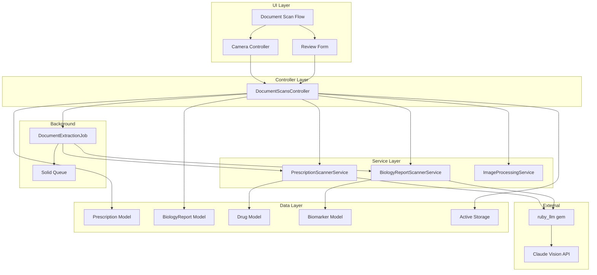
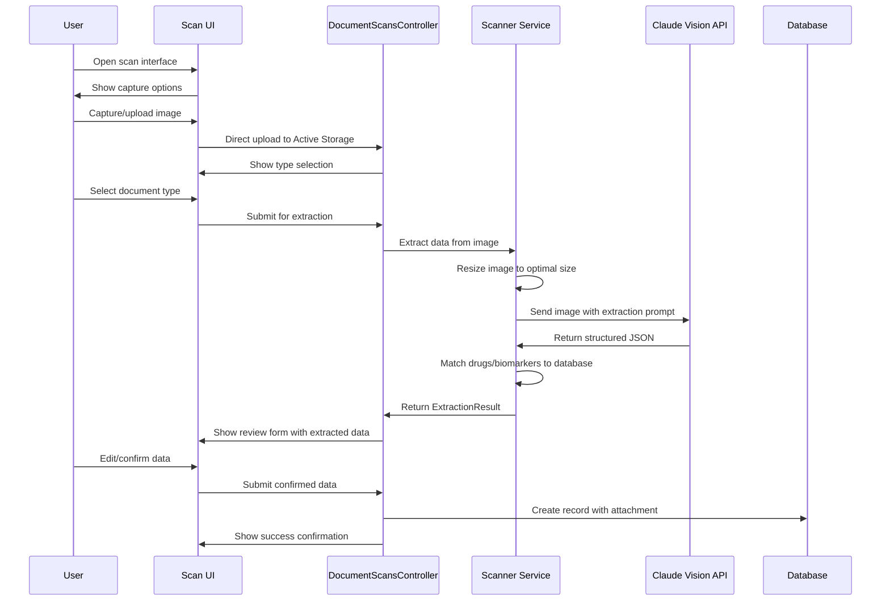
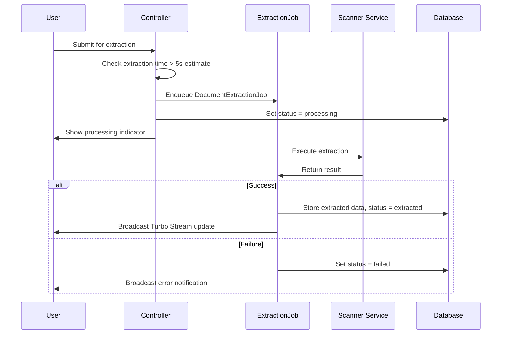

# Design Document: Document Scanning

## Overview

**Purpose**: This feature delivers AI-powered document scanning capabilities that enable users to digitize prescriptions and biology reports by capturing images and automatically extracting structured medical data using Claude Vision API.

**Users**: Health-conscious individuals (John persona) and caregivers (Jane persona) will utilize this for rapid digitization of medical documents, eliminating tedious manual data entry while maintaining accuracy through human review.

**Impact**: Extends the existing Prescription and BiologyReport management by adding image capture, AI-powered data extraction, and a guided multi-step scanning flow, significantly reducing the time to input medical records.

### Goals
- Enable camera capture and file upload of medical documents (prescriptions, lab reports)
- Automatically extract structured data using Claude Vision API with confidence scoring
- Provide editable review interface before saving extracted data
- Support background processing for long extractions with status tracking
- Maintain data accuracy through required user confirmation

### Non-Goals
- OCR accuracy guarantees without user verification
- Support for document types other than prescriptions and biology reports (Phase 4 scope)
- Automatic saving without user review
- Integration with external pharmacy or lab systems
- Real-time streaming of extraction results

## Architecture

### Existing Architecture Analysis

The application follows Rails MVC with service objects for complex logic:
- **Models**: Prescription, Medication, BiologyReport, TestResult, Drug, Biomarker exist with appropriate associations
- **Services**: DrugSearchService demonstrates Result object pattern for service outcomes
- **Validators**: DocumentValidator validates PDF, JPEG, PNG attachments
- **Stimulus Controllers**: Autocomplete patterns established (drug_search, biomarker_search)
- **Active Storage**: Configured with local disk, BiologyReport already has document attachment

### Architecture Pattern & Boundary Map



**Architecture Integration**:
- Selected pattern: Service-oriented within Rails MVC, following established DrugSearchService pattern
- Domain boundaries: Scanning logic isolated in services; models handle persistence; controller orchestrates flow
- Existing patterns preserved: Result objects, Active Storage attachments, Stimulus controllers, Turbo Frames
- New components rationale: Scanner services encapsulate Claude API integration; dedicated controller prevents bloating existing CRUD controllers
- Steering compliance: Follows ruby_llm integration patterns, Solid Queue for background jobs, Turbo for seamless UI

### Technology Stack

| Layer | Choice / Version | Role in Feature | Notes |
|-------|------------------|-----------------|-------|
| Backend / Services | ruby_llm gem (latest) | Claude Vision API integration | Unified LLM interface with schema support |
| Backend / Services | MiniMagick / ImageMagick | Image resizing before API | Resize to 1568px max dimension |
| Frontend / UI | Turbo Frames | Multi-step scan flow without full reloads | Existing pattern |
| Frontend / UI | Stimulus | Camera capture, upload progress, form handling | New controllers |
| Data / Storage | Active Storage | Document attachment storage | Extend to Prescription |
| Background | Solid Queue | Long-running extraction jobs | Existing infrastructure |

## System Flows

### Document Scanning Flow



### Background Extraction Flow



## Requirements Traceability

| Requirement | Summary | Components | Interfaces | Flows |
|-------------|---------|------------|------------|-------|
| 1.1-1.9 | Document capture and upload | CameraController, DocumentScansController, Active Storage | Direct Upload events, File validation | Capture flow |
| 2.1-2.5 | Document type selection | DocumentScansController, Scan views | Type selection form | Type selection step |
| 3.1-3.9 | Prescription extraction | PrescriptionScannerService, Drug model | ExtractionResult, DrugMatch | Extraction flow |
| 4.1-4.9 | Biology report extraction | BiologyReportScannerService, Biomarker model | ExtractionResult, BiomarkerMatch | Extraction flow |
| 5.1-5.9 | Review and confirmation | ReviewFormController, Review views | Editable form, Autocomplete | Review flow |
| 6.1-6.8 | Scan flow UX | All UI components, Turbo Frames | Frame updates, Progress indicators | Full flow |
| 7.1-7.10 | AI service architecture | Scanner services, ruby_llm | Schema classes, Error types | Extraction flow |
| 8.1-8.7 | Error handling | All components | Error types, User messages | Error paths |
| 9.1-9.6 | Security and privacy | All components | Scoped queries, Logging filters | All flows |
| 10.1-10.6 | Background processing | DocumentExtractionJob, Solid Queue | Job interface, Turbo Streams | Background flow |

## Components and Interfaces

| Component | Domain/Layer | Intent | Req Coverage | Key Dependencies | Contracts |
|-----------|--------------|--------|--------------|------------------|-----------|
| DocumentScansController | Controller | Orchestrate scan flow steps | 1, 2, 5, 6 | Scanner services, Active Storage | Service |
| PrescriptionScannerService | Service | Extract prescription data via Claude | 3, 7 | ruby_llm, Drug model | Service |
| BiologyReportScannerService | Service | Extract biology report data via Claude | 4, 7 | ruby_llm, Biomarker model | Service |
| ImageProcessingService | Service | Resize images for optimal API usage | 3.1, 4.1 | MiniMagick | Service |
| DocumentExtractionJob | Background | Async extraction processing | 10 | Scanner services, Solid Queue | Batch |
| CameraController (Stimulus) | UI | Camera capture and upload progress | 1, 6 | Active Storage direct upload | State |
| ReviewFormController (Stimulus) | UI | Form handling with confidence indicators | 5, 6 | Autocomplete | State |

### Service Layer

#### PrescriptionScannerService

| Field | Detail |
|-------|--------|
| Intent | Extract structured prescription data from images using Claude Vision API |
| Requirements | 3.1, 3.2, 3.3, 3.4, 3.5, 3.6, 3.7, 3.8, 3.9, 7.1, 7.3, 7.4, 7.5 |

**Responsibilities & Constraints**
- Send prescription images to Claude Vision API with extraction prompt
- Parse JSON response into structured medication data
- Match extracted drug names against local Drug database
- Assign confidence scores to extracted fields
- Truncate/resize images to fit token limits

**Dependencies**
- Outbound: ruby_llm gem - Claude Vision API access (P0)
- Outbound: Drug model - Drug name matching (P1)
- Outbound: ImageProcessingService - Image resizing (P1)

**Contracts**: Service [x] / API [ ] / Event [ ] / Batch [ ] / State [ ]

##### Service Interface

```ruby
# app/services/prescription_scanner_service.rb
class PrescriptionScannerService
  class Error < StandardError; end
  class ConfigurationError < Error; end
  class AuthenticationError < Error; end
  class RateLimitError < Error; end
  class ExtractionError < Error; end

  class ExtractionResult
    attr_reader :medications, :doctor_name, :prescription_date, :raw_response

    def initialize(success:, medications: [], doctor_name: nil,
                   prescription_date: nil, error_type: nil, error_message: nil,
                   raw_response: nil)
      @success = success
      @medications = medications
      @doctor_name = doctor_name
      @prescription_date = prescription_date
      @error_type = error_type
      @error_message = error_message
      @raw_response = raw_response
      freeze
    end

    def success?
      @success
    end

    def error?
      !@success
    end

    def self.success(medications:, doctor_name:, prescription_date:, raw_response:)
      new(success: true, medications: medications, doctor_name: doctor_name,
          prescription_date: prescription_date, raw_response: raw_response)
    end

    def self.error(type:, message:)
      new(success: false, error_type: type, error_message: message)
    end
  end

  class ExtractedMedication
    attr_reader :drug_name, :dosage, :frequency, :duration, :quantity,
                :confidence, :matched_drug, :requires_verification

    # Immutable data object for extracted medication
  end

  def initialize(image_blob:, llm_client: nil)
    @image_blob = image_blob
    @llm_client = llm_client || default_llm_client
  end

  def call
    # Returns ExtractionResult
  end
end
```

- Preconditions: Valid Active Storage blob attached, Claude API key configured
- Postconditions: Returns ExtractionResult with medications or error
- Invariants: Never raises exceptions for expected failures; maps API errors to domain errors

**Implementation Notes**
- Integration: Uses ruby_llm gem with PrescriptionExtractionSchema for structured output
- Validation: Validates image format before processing; handles malformed JSON responses
- Risks: API rate limits may affect throughput; mitigate with retry and backoff

#### BiologyReportScannerService

| Field | Detail |
|-------|--------|
| Intent | Extract structured lab test data from biology report images using Claude Vision API |
| Requirements | 4.1, 4.2, 4.3, 4.4, 4.5, 4.6, 4.7, 4.8, 4.9, 7.2, 7.3, 7.4, 7.5 |

**Responsibilities & Constraints**
- Send biology report images to Claude Vision API with extraction prompt
- Parse JSON response into structured test result data
- Match extracted biomarker names against local Biomarker database
- Flag out-of-range values based on reference ranges
- Assign confidence scores to extracted fields

**Dependencies**
- Outbound: ruby_llm gem - Claude Vision API access (P0)
- Outbound: Biomarker model - Biomarker name matching (P1)
- Outbound: ImageProcessingService - Image resizing (P1)

**Contracts**: Service [x] / API [ ] / Event [ ] / Batch [ ] / State [ ]

##### Service Interface

```ruby
# app/services/biology_report_scanner_service.rb
class BiologyReportScannerService
  class Error < StandardError; end
  class ConfigurationError < Error; end
  class AuthenticationError < Error; end
  class RateLimitError < Error; end
  class ExtractionError < Error; end

  class ExtractionResult
    attr_reader :test_results, :lab_name, :test_date, :raw_response

    def initialize(success:, test_results: [], lab_name: nil,
                   test_date: nil, error_type: nil, error_message: nil,
                   raw_response: nil)
      @success = success
      @test_results = test_results
      @lab_name = lab_name
      @test_date = test_date
      @error_type = error_type
      @error_message = error_message
      @raw_response = raw_response
      freeze
    end

    def success?
      @success
    end

    def error?
      !@success
    end

    def self.success(test_results:, lab_name:, test_date:, raw_response:)
      new(success: true, test_results: test_results, lab_name: lab_name,
          test_date: test_date, raw_response: raw_response)
    end

    def self.error(type:, message:)
      new(success: false, error_type: type, error_message: message)
    end
  end

  class ExtractedTestResult
    attr_reader :biomarker_name, :value, :unit, :reference_min, :reference_max,
                :confidence, :matched_biomarker, :out_of_range, :requires_verification

    # Immutable data object for extracted test result
  end

  def initialize(image_blob:, llm_client: nil)
    @image_blob = image_blob
    @llm_client = llm_client || default_llm_client
  end

  def call
    # Returns ExtractionResult
  end
end
```

- Preconditions: Valid Active Storage blob attached, Claude API key configured
- Postconditions: Returns ExtractionResult with test_results or error
- Invariants: Out-of-range flag computed when reference ranges available

**Implementation Notes**
- Integration: Uses ruby_llm gem with BiologyReportExtractionSchema for structured output
- Validation: Handles multi-page reports; validates numeric values
- Risks: Lab report formats vary widely; provide user verification for all fields

#### ImageProcessingService

| Field | Detail |
|-------|--------|
| Intent | Resize images to optimal dimensions for Claude Vision API |
| Requirements | 3.1, 4.1 |

**Responsibilities & Constraints**
- Resize images to max 1568px in largest dimension
- Preserve aspect ratio
- Convert HEIC to JPEG for API compatibility
- Return processed image as tempfile or blob

**Dependencies**
- Outbound: MiniMagick - Image processing (P0)

**Contracts**: Service [x] / API [ ] / Event [ ] / Batch [ ] / State [ ]

##### Service Interface

```ruby
# app/services/image_processing_service.rb
class ImageProcessingService
  MAX_DIMENSION = 1568

  def initialize(blob:)
    @blob = blob
  end

  def call
    # Returns ProcessedImage with path and dimensions
  end

  class ProcessedImage
    attr_reader :path, :width, :height, :content_type
  end
end
```

**Implementation Notes**
- Integration: Uses Active Storage variant processing or MiniMagick directly
- Validation: Validates image format before processing
- Risks: ImageMagick must be installed on server

### Controller Layer

#### DocumentScansController

| Field | Detail |
|-------|--------|
| Intent | Orchestrate the multi-step document scanning flow |
| Requirements | 1.1, 2.1, 5.5, 5.6, 6.1, 6.2, 9.2, 9.5 |

**Responsibilities & Constraints**
- Handle Turbo Frame requests for scan flow steps
- Scope all operations to authenticated user
- Coordinate between scanner services and models
- Manage extraction state transitions

**Dependencies**
- Inbound: Routes - HTTP requests (P0)
- Outbound: PrescriptionScannerService - Prescription extraction (P0)
- Outbound: BiologyReportScannerService - Biology report extraction (P0)
- Outbound: Prescription model - Record creation (P0)
- Outbound: BiologyReport model - Record creation (P0)
- Outbound: DocumentExtractionJob - Background processing (P1)

**Contracts**: Service [x] / API [ ] / Event [ ] / Batch [ ] / State [ ]

##### Service Interface

```ruby
# app/controllers/document_scans_controller.rb
class DocumentScansController < ApplicationController
  # GET /document_scans/new
  # Renders capture interface within Turbo Frame
  def new
  end

  # POST /document_scans/upload
  # Handles direct upload completion, shows type selection
  def upload
  end

  # POST /document_scans/extract
  # Triggers extraction, returns processing or review frame
  def extract
  end

  # GET /document_scans/:id/review
  # Shows editable review form with extracted data
  def review
  end

  # POST /document_scans/confirm
  # Creates Prescription or BiologyReport from confirmed data
  def confirm
  end

  private

  def scan_params
    params.require(:scan).permit(:document_type, :image)
  end
end
```

- Preconditions: User authenticated, valid CSRF token
- Postconditions: Turbo Frame responses for seamless transitions
- Invariants: All queries scoped to Current.user

**Implementation Notes**
- Integration: Uses Turbo Frames for step transitions; responds to turbo_stream and html
- Validation: Validates document type selection; validates image attachment
- Risks: Handle partial form state if user navigates away

### Background Layer

#### DocumentExtractionJob

| Field | Detail |
|-------|--------|
| Intent | Process document extraction asynchronously for long-running operations |
| Requirements | 10.1, 10.2, 10.3, 10.4, 10.5, 10.6 |

**Responsibilities & Constraints**
- Execute scanner service in background
- Update record extraction_status on completion/failure
- Broadcast Turbo Stream updates to user
- Support manual retry for failed extractions

**Dependencies**
- Outbound: PrescriptionScannerService - Extraction (P0)
- Outbound: BiologyReportScannerService - Extraction (P0)
- Outbound: Solid Queue - Job processing (P0)

**Contracts**: Service [ ] / API [ ] / Event [ ] / Batch [x] / State [ ]

##### Batch / Job Contract

```ruby
# app/jobs/document_extraction_job.rb
class DocumentExtractionJob < ApplicationJob
  queue_as :default

  retry_on PrescriptionScannerService::RateLimitError,
           BiologyReportScannerService::RateLimitError,
           wait: :polynomially_longer,
           attempts: 3

  discard_on PrescriptionScannerService::ConfigurationError,
             BiologyReportScannerService::ConfigurationError

  def perform(record_type:, record_id:, blob_id:)
    # record_type: "Prescription" or "BiologyReport"
  end
end
```

- Trigger: Enqueued when extraction estimated > 5 seconds or user selects background
- Input / validation: Record must exist and have pending extraction_status
- Output / destination: Updates record with extracted_data JSON and extraction_status
- Idempotency & recovery: Check extraction_status before processing; skip if already extracted

**Implementation Notes**
- Integration: Uses Solid Queue; broadcasts via Turbo Streams
- Validation: Validates record exists before processing
- Risks: Job may run after user navigates away; store results for later retrieval

### UI Layer

#### CameraController (Stimulus)

| Field | Detail |
|-------|--------|
| Intent | Handle camera capture, file selection, and upload progress |
| Requirements | 1.2, 1.4, 1.5, 1.6, 1.7, 6.3 |

**Contracts**: Service [ ] / API [ ] / Event [ ] / Batch [ ] / State [x]

##### State Management

```javascript
// app/javascript/controllers/camera_controller.js
import { Controller } from "@hotwired/stimulus"

export default class extends Controller {
  static targets = ["preview", "progress", "input", "submitButton"]
  static values = {
    maxSize: { type: Number, default: 10485760 } // 10MB
  }

  // State: idle | previewing | uploading | uploaded | error

  connect() {
    this.setupDirectUploadListeners()
  }

  capture(event) {
    // Handle file selection, show preview
  }

  // Direct upload event handlers
  handleUploadStart(event) {}
  handleUploadProgress(event) {}
  handleUploadEnd(event) {}
  handleUploadError(event) {}
}
```

- State model: Tracks upload lifecycle (idle -> previewing -> uploading -> uploaded)
- Persistence: No persistence; state resets on page navigation
- Concurrency: Single upload at a time; disable input during upload

**Implementation Notes**
- Integration: Listens to Active Storage direct upload events
- Validation: Validates file size before upload; shows error for oversized files
- Risks: Turbo may interfere with direct uploads; use data-turbo="false" on form if needed

#### ReviewFormController (Stimulus)

| Field | Detail |
|-------|--------|
| Intent | Manage review form with confidence indicators and autocomplete |
| Requirements | 5.1, 5.2, 5.3, 5.4, 6.4 |

**Contracts**: Service [ ] / API [ ] / Event [ ] / Batch [ ] / State [x]

##### State Management

```javascript
// app/javascript/controllers/review_form_controller.js
import { Controller } from "@hotwired/stimulus"

export default class extends Controller {
  static targets = ["field", "confidence", "submitButton"]

  connect() {
    this.highlightLowConfidenceFields()
  }

  highlightLowConfidenceFields() {
    // Add visual indicators for fields with confidence < 0.8
  }

  validateField(event) {
    // Mark field as user-verified when edited
  }
}
```

- State model: Tracks which fields have been user-verified
- Persistence: Hidden form fields store verification state
- Concurrency: Disable submit during async validation

**Implementation Notes**
- Integration: Works with existing drug_search and biomarker_search autocomplete controllers
- Validation: Requires user to review flagged fields before submission
- Risks: Complex forms may have many fields; consider tabbed interface for medications

## Data Models

### Domain Model

**Aggregates**:
- Prescription (aggregate root) - owns Medications, scanned_document attachment
- BiologyReport (aggregate root) - owns TestResults, document attachment

**New Attributes**:

```ruby
# Prescription model extension
class Prescription < ApplicationRecord
  has_one_attached :scanned_document

  enum :extraction_status, {
    manual: 0,           # Created without scanning
    pending: 1,          # Upload complete, extraction not started
    processing: 2,       # Extraction in progress
    extracted: 3,        # Extraction complete, awaiting review
    confirmed: 4,        # User confirmed extracted data
    failed: 5            # Extraction failed
  }, prefix: :extraction

  # Store raw extraction response for debugging/audit
  # extracted_data: jsonb
end

# BiologyReport model extension (already has document attachment)
class BiologyReport < ApplicationRecord
  enum :extraction_status, {
    manual: 0,
    pending: 1,
    processing: 2,
    extracted: 3,
    confirmed: 4,
    failed: 5
  }, prefix: :extraction

  # extracted_data: jsonb
end
```

**Business Rules & Invariants**:
- Extraction status can only progress forward (pending -> processing -> extracted -> confirmed)
- Failed extraction can be retried (failed -> pending)
- User must confirm before record is finalized
- Original scanned image always preserved regardless of extraction outcome

### Logical Data Model

**Prescription Table Extension**:

| Column | Type | Constraints | Notes |
|--------|------|-------------|-------|
| extraction_status | integer | default: 0, null: false | Enum for scan state |
| extracted_data | jsonb | null: true | Raw extraction JSON for audit |

**BiologyReport Table Extension**:

| Column | Type | Constraints | Notes |
|--------|------|-------------|-------|
| extraction_status | integer | default: 0, null: false | Enum for scan state |
| extracted_data | jsonb | null: true | Raw extraction JSON for audit |

**Active Storage Tables** (existing):
- active_storage_blobs - stores file metadata
- active_storage_attachments - polymorphic join to Prescription/BiologyReport

### RubyLLM Schema Definitions

```ruby
# app/schemas/prescription_extraction_schema.rb
class PrescriptionExtractionSchema < RubyLLM::Schema
  string :doctor_name, optional: true
  string :prescription_date, optional: true

  array :medications do
    string :drug_name
    string :dosage, optional: true
    string :frequency, optional: true
    string :duration, optional: true
    string :quantity, optional: true
    number :confidence  # 0.0 to 1.0
  end
end

# app/schemas/biology_report_extraction_schema.rb
class BiologyReportExtractionSchema < RubyLLM::Schema
  string :lab_name, optional: true
  string :test_date, optional: true

  array :test_results do
    string :biomarker_name
    string :value
    string :unit, optional: true
    string :reference_range, optional: true
    number :confidence  # 0.0 to 1.0
  end
end
```

## Error Handling

### Error Strategy

Scanner services use typed error classes mapped from ruby_llm errors. Controller catches service errors and renders appropriate user feedback. Background jobs use retry/discard strategies.

### Error Categories and Responses

**User Errors** (4xx):
- Invalid file type -> "Please upload a JPEG, PNG, or PDF file"
- File too large -> "File must be less than 10MB"
- No document in image -> "No medical document detected. Please verify the image"

**System Errors** (5xx):
- Claude API unavailable -> "Document processing temporarily unavailable. You can save the image and try again later."
- Rate limit exceeded -> Retry with backoff; show "Processing delayed, please wait"

**Business Logic Errors** (422):
- Image quality too low -> "Image is too blurry or low resolution. Please retake with better lighting."
- Unknown drug/biomarker -> Allow custom entry with warning
- Partial extraction -> Show extracted fields, flag missing as unverified

### Monitoring

- Log extraction failures with sanitized details (no medical content)
- Track extraction success rate by document type
- Alert on elevated error rates or API failures

## Testing Strategy

### Unit Tests
- PrescriptionScannerService: Mock ruby_llm, test JSON parsing, drug matching
- BiologyReportScannerService: Mock ruby_llm, test biomarker matching, out-of-range detection
- ImageProcessingService: Test resize logic, format conversion
- Schema validation: Test extraction schema with sample responses
- Model extraction_status transitions

### Integration Tests
- Full scan flow: Upload -> Extract -> Review -> Confirm
- Background extraction: Job enqueue, status updates, Turbo Stream broadcast
- Error recovery: API failure handling, retry logic
- User scoping: Verify records scoped to authenticated user

### E2E/UI Tests
- Camera capture on mobile viewport
- File upload with progress indicator
- Review form editing and confirmation
- Navigation between scan flow steps

### Performance
- Image resize time < 500ms for 10MB image
- Extraction API response handling (timeout at 120s)
- Background job throughput under load

## Security Considerations

### Data Protection
- All document operations scoped to authenticated user (`Current.user`)
- Scanned images stored in user-scoped Active Storage paths
- No PII sent in Claude API prompts (only image content)
- Extracted medical data not logged in plain text
- Images deleted when parent record deleted (dependent: :purge_later)

### API Security
- Claude API key stored in Rails credentials
- HTTPS only for all image transmission
- Rate limiting protects against API abuse

## Performance & Scalability

### Target Metrics
- Image upload: < 3 seconds for 10MB file
- Synchronous extraction: < 30 seconds for typical document
- Background extraction: < 120 seconds with notification

### Optimization Techniques
- Image resize before API call reduces tokens and latency
- Background processing for long extractions
- Direct upload bypasses Rails server for large files

## Supporting References

### Extraction Prompt Templates

**Prescription Extraction Prompt**:
```
Analyze this prescription image and extract medication information.

Return a JSON object with exactly these fields:
- doctor_name: Prescribing doctor's name (string, optional)
- prescription_date: Date on prescription in YYYY-MM-DD format (string, optional)
- medications: Array of medication objects with:
  - drug_name: Name of the medication (string, required)
  - dosage: Dosage amount and unit e.g. "500mg" (string, optional)
  - frequency: How often to take e.g. "twice daily" (string, optional)
  - duration: Treatment duration e.g. "7 days" (string, optional)
  - quantity: Number of pills/doses prescribed (string, optional)
  - confidence: Your confidence in this extraction from 0.0 to 1.0 (number, required)

If you cannot confidently identify a field, omit it or set confidence below 0.5.
Respond with ONLY valid JSON, no markdown formatting.
```

**Biology Report Extraction Prompt**:
```
Analyze this laboratory/biology report image and extract test results.

Return a JSON object with exactly these fields:
- lab_name: Name of the laboratory (string, optional)
- test_date: Date of the test in YYYY-MM-DD format (string, optional)
- test_results: Array of test result objects with:
  - biomarker_name: Name of the test/biomarker (string, required)
  - value: Measured value as string (string, required)
  - unit: Unit of measurement (string, optional)
  - reference_range: Normal range e.g. "3.5-5.0" (string, optional)
  - confidence: Your confidence in this extraction from 0.0 to 1.0 (number, required)

If you cannot confidently identify a field, omit it or set confidence below 0.5.
Respond with ONLY valid JSON, no markdown formatting.
```

### DocumentValidator Extension

```ruby
# Extend existing validator for HEIC and size limits
class DocumentValidator < ActiveModel::Validator
  ALLOWED_TYPES = %w[
    application/pdf
    image/jpeg
    image/png
    image/heic
    image/heif
  ].freeze

  MAX_FILE_SIZE = 10.megabytes

  def validate(record)
    return unless record.document&.attached?

    validate_content_type(record)
    validate_file_size(record)
  end

  private

  def validate_content_type(record)
    unless ALLOWED_TYPES.include?(record.document.content_type)
      record.errors.add(:document, "must be a PDF, JPEG, PNG, or HEIC file")
    end
  end

  def validate_file_size(record)
    if record.document.byte_size > MAX_FILE_SIZE
      record.errors.add(:document, "must be less than 10MB")
    end
  end
end
```
