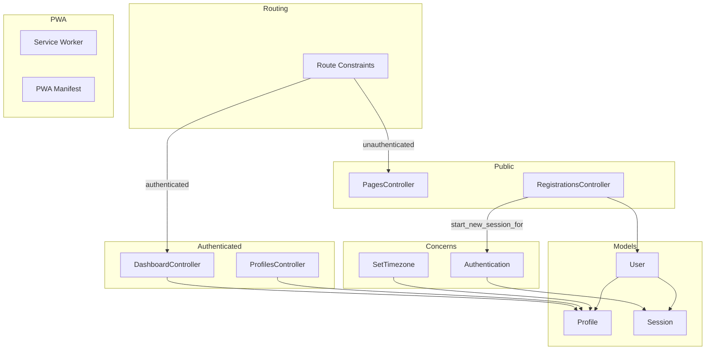
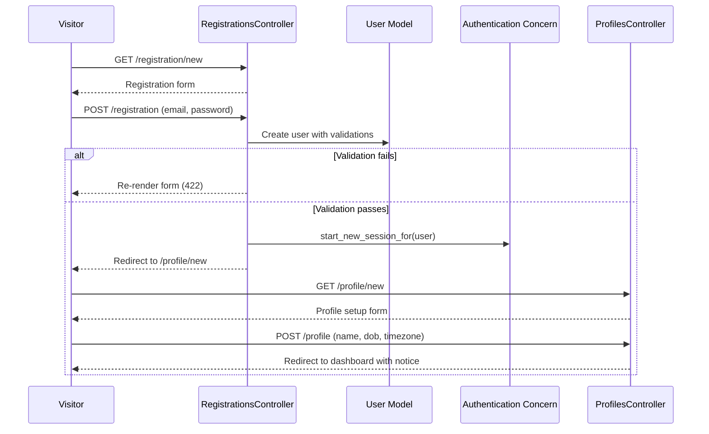
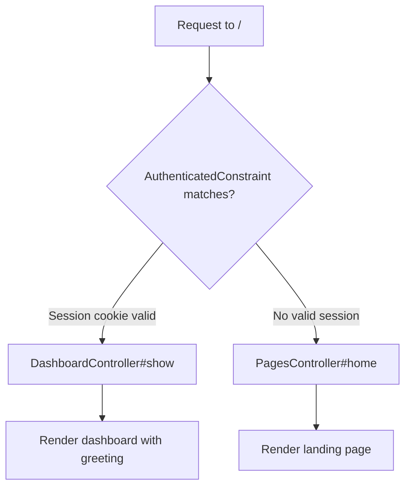

# Design Document: Foundation

---
**Purpose**: Provide sufficient detail to ensure implementation consistency across different implementers, preventing interpretation drift.

**Approach**:
- Include essential sections that directly inform implementation decisions
- Omit optional sections unless critical to preventing implementation errors
- Match detail level to feature complexity
- Use diagrams and tables over lengthy prose
---

## Overview

This feature establishes the core user-facing infrastructure for Avicen, a personal health management application built on Rails 8.1. It delivers user registration, profile management, a personalized dashboard, a public landing page, responsive navigation, PWA installability, timezone support, and deployment readiness.

**Users**: Visitors interact with the landing page and registration flow. Authenticated users manage their profile, view the dashboard, and install the app as a PWA.

**Impact**: Transforms the existing authentication scaffold into a functional application with complete user lifecycle management and production deployment capability.

### Goals
- Deliver a complete user registration and profile management flow
- Provide differentiated experiences for authenticated and unauthenticated users at the root path
- Activate PWA capabilities with offline fallback
- Establish responsive navigation and layout patterns for all future features
- Harden the deployment configuration for production readiness

### Non-Goals
- Email verification flow (deferred, noted as optional in authentication steering)
- OAuth or social login integration
- ViewComponent architecture (planned for later phases)
- Content Security Policy configuration
- Kamal deployment target configuration (IP addresses, registry)
- Advanced PWA caching strategies beyond offline fallback

## Architecture

### Existing Architecture Analysis

The codebase is a Rails 8.1 application with the following established patterns:
- **Authentication**: Session-based via `Authentication` concern included in `ApplicationController`. All controllers require authentication by default; public actions opt out with `allow_unauthenticated_access`.
- **Current Attributes**: `Current.session` and `Current.user` provide request-scoped access to the authenticated user.
- **Frontend**: Hotwire (Turbo + Stimulus), Tailwind CSS, Propshaft, Importmap.
- **Infrastructure**: Solid Queue, Solid Cache, Solid Cable configured. Dockerfile with Thruster for HTTP caching/compression.
- **Database**: SQLite3 with `users` and `sessions` tables. Unique index on `email_address`.

Constraints to respect:
- Authentication concern pattern must remain the foundation for all auth logic.
- `start_new_session_for(user)` is the canonical method for session creation after login or registration.
- `Current.user` is the established pattern for accessing the authenticated user.

### Architecture Pattern & Boundary Map



**Architecture Integration**:
- Selected pattern: Standard Rails MVC with controller concerns for cross-cutting behavior (authentication, timezone). No new architectural patterns introduced.
- Domain boundaries: Authentication (User, Session) remains separate from personal data (Profile). New controllers each have a single responsibility.
- Existing patterns preserved: `Authentication` concern, `Current` attributes, `allow_unauthenticated_access` opt-out, rate limiting on auth endpoints.
- New components rationale: Each new controller handles a distinct resource or page. The `SetTimezone` concern encapsulates per-request timezone logic. `AuthenticatedConstraint` enables dual-root routing at the routing layer.
- Steering compliance: Thin controllers, lean models, Hotwire for interactivity, Minitest for testing, Tailwind for styling.

### Technology Stack

| Layer | Choice / Version | Role in Feature | Notes |
|-------|------------------|-----------------|-------|
| Backend | Rails 8.1, Ruby 3.4.7 | Application framework, MVC controllers, models, views | Existing |
| Frontend | Hotwire (Turbo + Stimulus), Tailwind CSS | Turbo Frames for profile updates, Stimulus for mobile nav toggle, Tailwind for responsive layout | Existing; new Stimulus controller for navbar |
| Data | SQLite3 | Primary database for users, sessions, profiles | New `profiles` table |
| Assets | Propshaft, Importmap | Asset pipeline and JavaScript modules | Existing |
| PWA | Service Worker, Web App Manifest | Offline fallback, installability | Activating existing scaffold |
| Infrastructure | Puma + Thruster, Kamal, Solid Stack | Production web server, deployment, background jobs/cache/cable | Existing; SSL configuration activation |

## System Flows

### Registration and Profile Setup Flow



### Root Path Routing Flow



The `AuthenticatedConstraint` checks `request.cookie_jar.signed[:session_id]` against the sessions table. The authenticated root is declared before the unauthenticated root in routes, leveraging Rails top-down route matching. See `research.md` for the full evaluation of routing alternatives.

## Requirements Traceability

| Requirement | Summary | Components | Interfaces | Flows |
|-------------|---------|------------|------------|-------|
| 1.1 | Post-registration redirect to profile setup | RegistrationsController | create action redirect | Registration Flow |
| 1.2 | Profile belongs_to User (one-to-one) | Profile, User | has_one / belongs_to | -- |
| 1.3 | Profile fields: name, date_of_birth, timezone | Profile, CreateProfiles migration | -- | -- |
| 1.4 | Save profile, redirect to dashboard | ProfilesController | create action | Registration Flow |
| 1.5 | Validation errors re-render form (422) | ProfilesController | create/update actions | -- |
| 1.6 | Validate name presence | Profile | validates :name, presence: true | -- |
| 1.7 | Settings page shows editable profile | ProfilesController | edit action | -- |
| 1.8 | Update profile with success notice | ProfilesController | update action | -- |
| 1.9 | Scope profile access to current user | ProfilesController | Current.user.profile / build_profile | -- |
| 1.10 | Turbo Frame for profile form | ProfilesController, profile views | turbo_frame_tag | -- |
| 2.1 | PWA manifest at /manifest.json | PWA Manifest, routes | GET /manifest | -- |
| 2.2 | Manifest link tag in layout | Application layout | link rel=manifest | -- |
| 2.3 | Manifest: name, display, colors | PWA Manifest | manifest.json.erb | -- |
| 2.4 | Register service worker | Service Worker, routes | GET /service-worker | -- |
| 2.5 | Offline fallback page | Service Worker, offline.html | fetch event handler | -- |
| 2.6 | PWA meta tags in layout | Application layout | meta tags | -- |
| 2.7 | PWA installability criteria | PWA Manifest, Service Worker | -- | -- |
| 2.8 | Icons 512x512 with maskable | PWA Manifest | icons array | -- |
| 3.1 | Authenticated root shows dashboard | DashboardController, AuthenticatedConstraint | show action | Root Path Flow |
| 3.2 | Dashboard greets by name | DashboardController, dashboard view | show action | -- |
| 3.3 | Dashboard prompts profile completion | DashboardController, dashboard view | show action | -- |
| 3.4 | Dashboard requires authentication | DashboardController | inherits from ApplicationController | -- |
| 3.5 | Dashboard is after-auth redirect target | Authentication concern | after_authentication_url | -- |
| 3.6 | Dedicated DashboardController | DashboardController | show action | -- |
| 4.1 | Unauthenticated root shows landing page | PagesController, AuthenticatedConstraint | home action | Root Path Flow |
| 4.2 | Landing page description | Landing page view | -- | -- |
| 4.3 | Landing page login link | Landing page view | new_session_path | -- |
| 4.4 | Landing page registration link | Landing page view | new_registration_path | -- |
| 4.5 | Unauthenticated access to landing | PagesController | allow_unauthenticated_access | -- |
| 4.6 | Authenticated redirect from landing to dashboard | AuthenticatedConstraint | route constraint | Root Path Flow |
| 5.1 | Registration page without auth | RegistrationsController | allow_unauthenticated_access | -- |
| 5.2 | Create account, start session | RegistrationsController | create action | Registration Flow |
| 5.3 | Duplicate email error | User model | validates uniqueness | -- |
| 5.4 | Email presence and uniqueness | User model | validates | -- |
| 5.5 | Password minimum length | User model | validates :password, length | -- |
| 5.6 | Redirect to profile setup after registration | RegistrationsController | create action redirect | Registration Flow |
| 5.7 | Email normalization | User model | normalizes (existing) | -- |
| 6.1 | Responsive navigation bar | Navigation partial | _navbar.html.erb | -- |
| 6.2 | Nav links: dashboard, settings | Navigation partial | link helpers | -- |
| 6.3 | Nav logout action | Navigation partial | session_path, method: :delete | -- |
| 6.4 | Display user name/email in nav | Navigation partial | Current.user | -- |
| 6.5 | Mobile-first Tailwind layout | Application layout, Navigation partial | Tailwind classes | -- |
| 6.6 | Single layout, conditional content | Application layout | authenticated? helper | -- |
| 7.1 | Health check /up returns 200 | Routes | Existing | -- |
| 7.2 | Solid Queue in production | Production config | Existing | -- |
| 7.3 | Solid Cache in production | Production config | Existing | -- |
| 7.4 | Solid Cable in production | Production config | Existing | -- |
| 7.5 | Encrypted credentials | Rails credentials | Existing | -- |
| 7.6 | Production Dockerfile | Dockerfile | Existing | -- |
| 7.7 | Propshaft cache headers | Production config | Existing | -- |
| 7.8 | SSL enforcement in production | Production config | force_ssl, assume_ssl | -- |
| 8.1 | Timezone in profile | Profile model | timezone column | -- |
| 8.2 | Apply timezone to date/time displays | SetTimezone concern | around_action | -- |
| 8.3 | Timezone dropdown in profile form | Profile form view | time_zone_select | -- |
| 8.4 | Default to UTC | SetTimezone concern | fallback logic | -- |
| 8.5 | Time.use_zone pattern | SetTimezone concern | around_action with Time.use_zone | -- |

## Components and Interfaces

| Component | Domain/Layer | Intent | Req Coverage | Key Dependencies | Contracts |
|-----------|--------------|--------|--------------|------------------|-----------|
| User (ext.) | Model | Extend with profile association and validations | 1.2, 5.3, 5.4, 5.5, 5.7 | Profile (P0) | -- |
| Profile | Model | Store user personal data | 1.2, 1.3, 1.6, 8.1 | User (P0) | -- |
| RegistrationsController | Controller | Handle user sign-up | 5.1-5.7, 1.1 | User (P0), Authentication (P0) | Service |
| DashboardController | Controller | Render post-login dashboard | 3.1-3.6 | Profile (P1) | Service |
| PagesController | Controller | Render public landing page | 4.1-4.5 | -- | Service |
| ProfilesController | Controller | CRUD for user profile | 1.1, 1.4-1.10, 8.3 | Profile (P0) | Service |
| SetTimezone | Concern | Apply per-request timezone | 8.2, 8.4, 8.5 | Profile (P1) | -- |
| AuthenticatedConstraint | Routing | Route-level auth check | 3.1, 4.1, 4.6 | Session (P0) | -- |
| Navigation partial | View | Responsive nav bar | 6.1-6.6 | -- | -- |
| Application layout (ext.) | View | Add nav, PWA tags, conditional content | 2.2, 2.6, 6.5, 6.6 | Navigation partial (P1) | -- |
| PWA Manifest (ext.) | PWA | App metadata for installability | 2.1, 2.3, 2.7, 2.8 | -- | -- |
| Service Worker (ext.) | PWA | Offline fallback | 2.4, 2.5 | offline.html (P1) | -- |
| Production config (ext.) | Config | SSL enforcement | 7.8 | -- | -- |
| NavToggle Stimulus | JS | Mobile hamburger menu toggle | 6.1, 6.5 | -- | -- |
| CreateProfiles migration | Data | Create profiles table | 1.3 | -- | -- |

### Models

#### Profile

| Field | Detail |
|-------|--------|
| Intent | Store user personal data (name, date of birth, timezone) |
| Requirements | 1.2, 1.3, 1.6, 8.1 |

**Responsibilities & Constraints**
- Belongs to User with a one-to-one association (User `has_one :profile`)
- Validates presence of `name`
- Validates `timezone` inclusion in `ActiveSupport::TimeZone` names when present
- Profile data is scoped to the owning user; no cross-user access

**Dependencies**
- Inbound: User -- ownership association (P0)
- Inbound: ProfilesController -- CRUD operations (P0)
- Inbound: SetTimezone -- reads timezone value (P1)
- Inbound: DashboardController -- reads name for greeting (P1)

**Contracts**: State [x]

##### State Management
- State model: ActiveRecord model with `name` (string, required), `date_of_birth` (date, optional), `timezone` (string, optional, defaults to nil/UTC)
- Persistence: SQLite3 `profiles` table with `user_id` foreign key (unique index)
- Concurrency: Standard Rails optimistic locking not required (single-user access pattern)

#### User (Extension)

| Field | Detail |
|-------|--------|
| Intent | Extend existing User model with profile association and registration validations |
| Requirements | 1.2, 5.3, 5.4, 5.5, 5.7 |

**Responsibilities & Constraints**
- Add `has_one :profile, dependent: :destroy`
- Add `validates :email_address, presence: true, uniqueness: { case_sensitive: false }`
- Add `validates :password, length: { minimum: 8 }, if: -> { password.present? }`
- Existing `normalizes :email_address` and `has_secure_password` remain unchanged

**Dependencies**
- Outbound: Profile -- has_one association (P0)
- Existing: Session -- has_many association (unchanged)

**Implementation Notes**
- The `if: -> { password.present? }` guard on password length validation prevents the validation from firing on records loaded from the database, where `password` is nil. See `research.md` for details on this Rails quirk.
- Email uniqueness validation in the model supplements the existing database unique index, providing user-facing error messages.

### Controllers

#### RegistrationsController

| Field | Detail |
|-------|--------|
| Intent | Handle new user registration (sign-up) |
| Requirements | 5.1, 5.2, 5.3, 5.4, 5.5, 5.6, 5.7, 1.1 |

**Responsibilities & Constraints**
- Allows unauthenticated access (public registration form)
- Creates a new User record with email and password
- Starts an authenticated session on successful registration via `start_new_session_for`
- Redirects to profile setup (`new_profile_path`) after successful registration
- Re-renders form with validation errors on failure (status 422)
- Rate-limited to prevent abuse

**Dependencies**
- Outbound: User model -- creates new user (P0)
- Outbound: Authentication concern -- `start_new_session_for` for session creation (P0)

**Contracts**: Service [x]

##### Service Interface
```ruby
# RegistrationsController
# Actions: new, create
#
# new -> renders registration form
# create(registration_params) -> creates user, starts session, redirects
#
# registration_params: { email_address: String, password: String, password_confirmation: String }
# Success: redirect to new_profile_path
# Failure: render :new, status: :unprocessable_entity
```
- Preconditions: User is unauthenticated
- Postconditions: New User record exists, authenticated Session created, redirect to profile setup
- Invariants: Email uniqueness enforced at model and database level

**Implementation Notes**
- Integration: Uses `start_new_session_for(user)` from the Authentication concern, same as SessionsController#create.
- Validation: Strong parameters permit only `email_address`, `password`, `password_confirmation`. All validation handled by User model.
- Risks: None significant. Standard Rails CRUD pattern.

#### DashboardController

| Field | Detail |
|-------|--------|
| Intent | Render the authenticated user's dashboard |
| Requirements | 3.1, 3.2, 3.3, 3.4, 3.5, 3.6 |

**Responsibilities & Constraints**
- Requires authentication (inherits default from ApplicationController)
- Renders dashboard view with user greeting and profile status
- Does not modify any data (read-only)

**Dependencies**
- Inbound: AuthenticatedConstraint -- routes authenticated root here (P0)
- Outbound: Current.user.profile -- reads profile for greeting (P1)

**Contracts**: Service [x]

##### Service Interface
```ruby
# DashboardController
# Actions: show
#
# show -> renders dashboard with @user (Current.user) and @profile (Current.user.profile)
# No params required
```
- Preconditions: User is authenticated
- Postconditions: Dashboard view rendered with user context

**Implementation Notes**
- The view checks `@profile.present?` to determine whether to show the greeting (using `@profile.name`) or a profile completion prompt.
- This is the `after_authentication_url` target. The Authentication concern's default `root_url` already points here via the authenticated route constraint.

#### PagesController

| Field | Detail |
|-------|--------|
| Intent | Render public pages (landing page) |
| Requirements | 4.1, 4.2, 4.3, 4.4, 4.5 |

**Responsibilities & Constraints**
- Allows unauthenticated access for the `home` action
- Renders the public landing page with app description and auth links

**Dependencies**
- Inbound: Routes -- unauthenticated root points here (P0)

**Contracts**: Service [x]

##### Service Interface
```ruby
# PagesController
# Actions: home
#
# home -> renders landing page
# No params required
```
- Preconditions: None (public access)
- Postconditions: Landing page rendered

**Implementation Notes**
- Requirement 4.6 (authenticated user redirect from landing to dashboard) is handled entirely by `AuthenticatedConstraint` at the routing layer. An authenticated user never reaches `PagesController#home` because the constraint routes them to the dashboard first.

#### ProfilesController

| Field | Detail |
|-------|--------|
| Intent | CRUD operations for user profile |
| Requirements | 1.1, 1.4, 1.5, 1.6, 1.7, 1.8, 1.9, 1.10, 8.3 |

**Responsibilities & Constraints**
- Requires authentication (inherits default)
- Scopes all profile access to `Current.user`
- Handles both initial profile creation (new/create) and editing (edit/update)
- Wraps form content in a Turbo Frame for seamless updates
- Profile form includes timezone dropdown populated from `ActiveSupport::TimeZone` list

**Dependencies**
- Outbound: Profile model -- CRUD operations (P0)
- Outbound: Current.user -- scoping (P0)

**Contracts**: Service [x]

##### Service Interface
```ruby
# ProfilesController
# Actions: new, create, edit, update
#
# new -> renders profile setup form (for first-time setup)
# create(profile_params) -> creates profile for Current.user, redirects to dashboard
# edit -> renders profile edit form (settings page)
# update(profile_params) -> updates Current.user.profile, re-renders or redirects
#
# profile_params: { name: String, date_of_birth: Date, timezone: String }
# Success (create): redirect to root_path with success notice
# Success (update): redirect or Turbo Frame replace with success notice
# Failure: render form, status: :unprocessable_entity
```
- Preconditions: User is authenticated; for edit/update, profile must exist
- Postconditions: Profile created or updated for Current.user
- Invariants: Profile always belongs to Current.user; no cross-user access

**Implementation Notes**
- Integration: Uses `Current.user.build_profile(profile_params)` for create and `Current.user.profile` for edit/update, ensuring ownership scoping.
- Validation: Strong parameters permit `name`, `date_of_birth`, `timezone`. Profile model validates `name` presence.
- The profile form is wrapped in `turbo_frame_tag "profile_form"` to enable Turbo Frame updates without full-page reloads (1.10).

### Concerns

#### SetTimezone

| Field | Detail |
|-------|--------|
| Intent | Apply the user's preferred timezone for each request |
| Requirements | 8.2, 8.4, 8.5 |

**Responsibilities & Constraints**
- Included in `ApplicationController`
- Uses `around_action` with `Time.use_zone` to scope timezone to the request
- Reads timezone from `Current.user&.profile&.timezone`
- Defaults to `"UTC"` when no user or no profile or no timezone is set

**Dependencies**
- Inbound: ApplicationController -- includes this concern (P0)
- Outbound: Current.user.profile.timezone -- reads timezone value (P1)

**Implementation Notes**
- Must use `around_action` (not `before_action` with `Time.zone=`) to prevent timezone leakage between requests. See `research.md` for rationale.
- The concern yields unconditionally, wrapping the block in the resolved timezone.

### Routing

#### AuthenticatedConstraint

| Field | Detail |
|-------|--------|
| Intent | Determine at the routing layer whether a request comes from an authenticated user |
| Requirements | 3.1, 4.1, 4.6 |

**Responsibilities & Constraints**
- Implements `self.matches?(request)` for use as a Rails route constraint
- Checks `request.cookie_jar.signed[:session_id]` against the sessions table
- Returns `true` if a valid session exists, `false` otherwise

**Dependencies**
- Outbound: Session model -- existence check by primary key (P0)

**Implementation Notes**
- Located in `app/constraints/authenticated_constraint.rb`.
- The constraint performs a lightweight `Session.exists?(id:)` query. This is an indexed primary key lookup, negligible in cost.
- The authenticated root must be declared before the unauthenticated root in `config/routes.rb`. See `research.md` for the routing alternatives evaluation.

### Views (Summary Only)

The following view components are presentational with no new boundaries. They use Tailwind CSS utility classes and ERB.

**Navigation Partial** (`app/views/shared/_navbar.html.erb`)
- Responsive navigation bar rendered in the application layout
- Conditional content: shows dashboard/settings/logout links and user name/email when authenticated; hidden or minimal when unauthenticated
- Mobile hamburger toggle via a `NavToggle` Stimulus controller
- Requirements: 6.1, 6.2, 6.3, 6.4, 6.5, 6.6

**Dashboard View** (`app/views/dashboard/show.html.erb`)
- Greets user by name if profile exists (3.2)
- Shows profile completion prompt if no profile (3.3)
- Requirements: 3.2, 3.3

**Landing Page View** (`app/views/pages/home.html.erb`)
- App description, login link (`new_session_path`), registration link (`new_registration_path`)
- Requirements: 4.2, 4.3, 4.4

**Registration View** (`app/views/registrations/new.html.erb`)
- Form with email, password, password_confirmation fields
- Displays validation errors inline
- Requirements: 5.1

**Profile Views** (`app/views/profiles/new.html.erb`, `app/views/profiles/edit.html.erb`, `app/views/profiles/_form.html.erb`)
- Shared form partial with name, date_of_birth, and timezone (dropdown) fields
- Wrapped in `turbo_frame_tag "profile_form"` for Turbo Frame updates
- Requirements: 1.4, 1.5, 1.7, 1.8, 1.10, 8.3

**Offline Page** (`public/offline.html`)
- Static HTML page displayed when the service worker catches a failed navigation request
- Simple message indicating the user is offline
- Requirement: 2.5

### PWA (Summary Only)

**PWA Manifest** (`app/views/pwa/manifest.json.erb` -- extension)
- Update `theme_color` and `background_color` from placeholder "red" to appropriate brand colors (e.g., `#1e40af` blue-800 or similar health-oriented palette)
- Update `description` to a full app description
- Existing icon entries (512x512 regular and maskable) satisfy 2.8
- Requirements: 2.1, 2.3, 2.7, 2.8

**Service Worker** (`app/views/pwa/service-worker.js` -- extension)
- `install` event: pre-cache `/offline.html`
- `fetch` event: intercept navigation requests; on network failure, return cached offline page
- No external libraries (vanilla JavaScript)
- Requirements: 2.4, 2.5

### Configuration (Summary Only)

**Application Layout** (`app/views/layouts/application.html.erb` -- extension)
- Uncomment manifest link tag
- Add `theme-color` meta tag
- Render navigation partial
- Requirements: 2.2, 2.6, 6.6

**Routes** (`config/routes.rb` -- extension)
- Uncomment PWA manifest and service worker routes
- Add `resource :registration, only: [:new, :create]`
- Add `resource :profile, only: [:new, :create, :edit, :update]`
- Add constrained authenticated root and unauthenticated root
- Requirements: 2.1, 2.4, 3.1, 4.1, 5.1

**Production Config** (`config/environments/production.rb` -- extension)
- Uncomment `config.assume_ssl = true`
- Uncomment `config.force_ssl = true`
- Uncomment `config.ssl_options` with health check exclusion
- Requirement: 7.8

**NavToggle Stimulus Controller** (`app/javascript/controllers/nav_toggle_controller.js`)
- Toggles visibility of the mobile navigation menu
- Uses Stimulus targets and CSS class toggling
- Requirements: 6.1, 6.5

## Data Models

### Domain Model

The Foundation feature introduces one new entity (Profile) and extends one existing entity (User).

```mermaid
erDiagram
    USER ||--o{ SESSION : "has many"
    USER ||--o| PROFILE : "has one"

    USER {
        integer id PK
        string email_address UK
        string password_digest
        datetime created_at
        datetime updated_at
    }

    SESSION {
        integer id PK
        integer user_id FK
        string ip_address
        string user_agent
        datetime created_at
        datetime updated_at
    }

    PROFILE {
        integer id PK
        integer user_id FK_UK
        string name
        date date_of_birth
        string timezone
        datetime created_at
        datetime updated_at
    }
```

**Aggregates**: User is the aggregate root. Profile is an owned entity within the User aggregate. Deleting a user cascades to destroy the profile and all sessions.

**Invariants**:
- A User has at most one Profile (enforced by unique index on `profiles.user_id`)
- Profile `name` is always present when a profile exists
- Profile `timezone` is either nil (default UTC) or a valid `ActiveSupport::TimeZone` name

### Physical Data Model

**New Table: `profiles`**

| Column | Type | Constraints | Notes |
|--------|------|-------------|-------|
| id | integer | PK, auto-increment | Rails default |
| user_id | integer | NOT NULL, FK to users(id), UNIQUE | One-to-one with users |
| name | string | NOT NULL | Required by validation |
| date_of_birth | date | nullable | Optional |
| timezone | string | nullable | Valid ActiveSupport::TimeZone name or nil |
| created_at | datetime | NOT NULL | Rails timestamps |
| updated_at | datetime | NOT NULL | Rails timestamps |

**Indexes**:
- `index_profiles_on_user_id` (unique) -- enforces one-to-one, optimizes lookups

**Migration**:
```ruby
class CreateProfiles < ActiveRecord::Migration[8.1]
  def change
    create_table :profiles do |t|
      t.references :user, null: false, foreign_key: true, index: { unique: true }
      t.string :name, null: false
      t.date :date_of_birth
      t.string :timezone
      t.timestamps
    end
  end
end
```

## Error Handling

### Error Strategy

Error handling follows the established patterns from the Authentication concern and SessionsController. Controllers return appropriate HTTP status codes and re-render forms with error messages.

### Error Categories and Responses

**User Errors (4xx)**:
- Invalid registration data (duplicate email, short password) -- Model validation errors displayed inline on the form, status 422
- Invalid profile data (missing name) -- Model validation errors displayed inline on the form, status 422
- Unauthenticated access to protected pages -- Redirect to login page (existing Authentication concern behavior)

**System Errors (5xx)**:
- Database errors during record creation -- Standard Rails error handling; no custom logic needed for Foundation scope
- No external service dependencies to fail

### Monitoring

- Standard Rails request logging covers all new endpoints
- Rate limiting on RegistrationsController#create prevents abuse (same pattern as SessionsController)
- No additional monitoring infrastructure needed for Foundation scope

## Testing Strategy

### Unit Tests (Models)
- Profile model: validates name presence, validates timezone inclusion, belongs_to user association, rejects duplicate user_id
- User model (extension): validates email presence and uniqueness (case-insensitive), validates password minimum length, has_one profile association, has_one profile dependent destroy

### Controller Tests
- RegistrationsController: successful registration creates user and session, redirects to profile setup; invalid data re-renders form with 422; duplicate email shows error; rate limiting applies
- DashboardController: authenticated user sees dashboard; unauthenticated user is redirected to login; greeting shows profile name; profile prompt shown when no profile
- PagesController: unauthenticated user sees landing page
- ProfilesController: create profile for current user, redirects to dashboard; update profile; edit renders form; validation errors re-render with 422; scoped to current user only

### Integration Tests
- Full registration flow: register, redirect to profile setup, create profile, land on dashboard with greeting
- Root path routing: unauthenticated request shows landing page; authenticated request shows dashboard
- Profile editing via Turbo Frame: verify frame response without full-page reload

### System Tests
- Landing page: visible description, login and signup links functional
- Registration: fill form, submit, see profile setup page
- Dashboard: after login, see personalized greeting
- Navigation: responsive nav visible on desktop, hamburger toggle on mobile

## Security Considerations

- **Registration rate limiting**: Apply `rate_limit to: 10, within: 3.minutes` on RegistrationsController#create, consistent with SessionsController pattern.
- **Password security**: Minimum 8-character password enforced by model validation. Bcrypt hashing via `has_secure_password`.
- **Profile scoping**: All profile operations scoped to `Current.user`, preventing unauthorized access to other users' data.
- **CSRF protection**: Enabled by default in ApplicationController (Rails default).
- **SSL enforcement**: `force_ssl` and `assume_ssl` activated in production configuration (7.8).
- **Strong parameters**: All controllers use explicit `params.permit` with only allowed attributes.

## Performance & Scalability

- **AuthenticatedConstraint query**: `Session.exists?(id:)` is a primary key lookup on an indexed column. For SQLite3 with the expected user base of a personal health app, this is negligible (sub-millisecond).
- **Profile eager loading**: Dashboard and navigation access profile data. Use `Current.user` with `includes(:profile)` or lazy loading (single user per request, no N+1 risk).
- **Turbo Frame profile updates**: Reduces payload size for profile edits by replacing only the form frame instead of the entire page.
- **No caching required**: Foundation pages are user-specific and low-traffic. Fragment caching can be introduced in later phases if needed.
