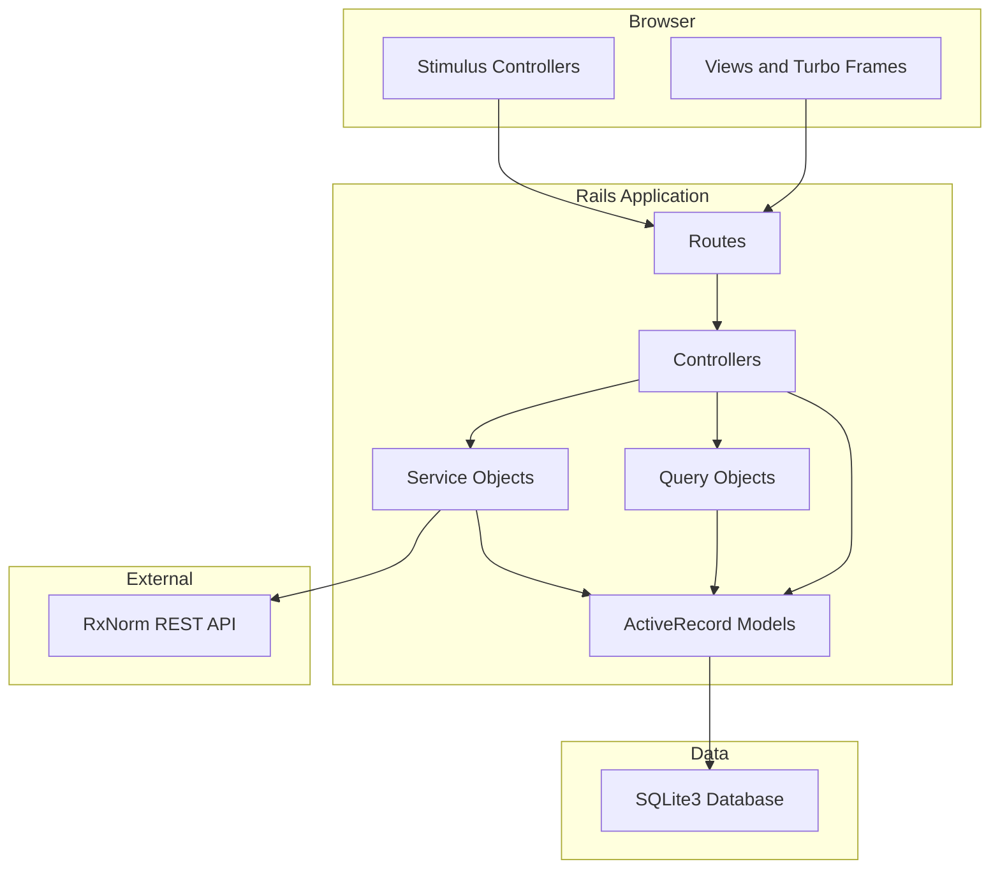
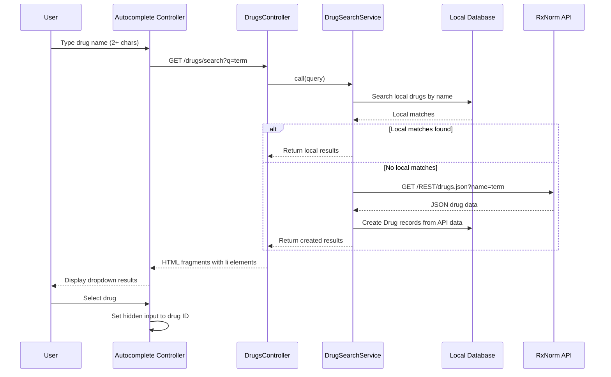
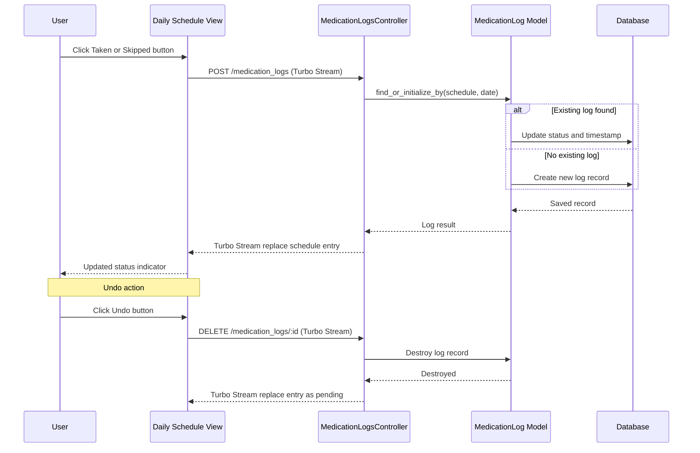
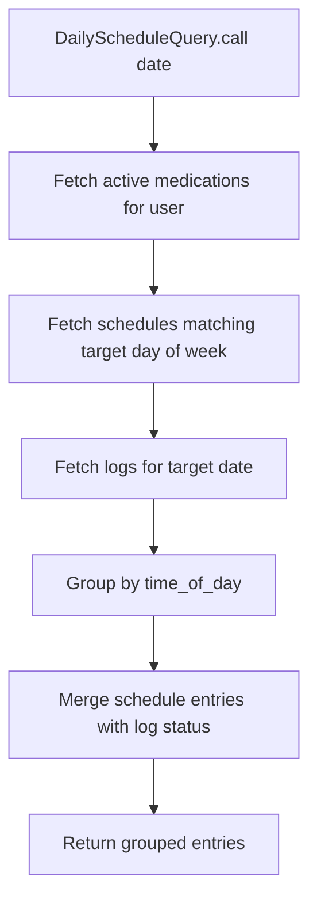
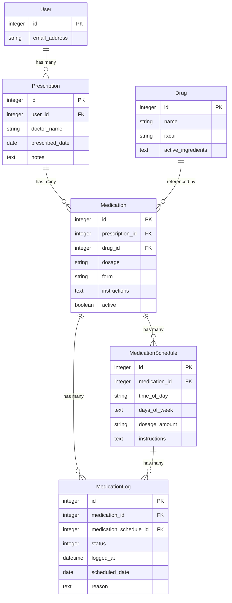

# Design Document: medication-foundation

---
**Purpose**: Provide sufficient detail to ensure implementation consistency across different implementers, preventing interpretation drift.
---

## Overview

This feature delivers a complete medication management subsystem to authenticated Avicen users. It enables users to define prescriptions, link medications to known drugs via an external drug database, configure complex dosing schedules, view daily and weekly medication plans, log doses as taken or skipped, and review adherence history over configurable time periods.

**Users**: Authenticated individuals managing personal medication regimens. They use Avicen on mobile and desktop devices to track daily medications, share printable plans with caregivers or doctors, and monitor adherence patterns.

**Impact**: Introduces the first domain-specific feature on top of the Phase 0 foundation (User, Profile, Session, authentication, PWA). Creates five new database models, the first service objects in `app/services/`, the first query objects in `app/queries/`, three new Stimulus controllers, and a new `stimulus-autocomplete` JavaScript dependency via importmap.

### Goals

- Enable manual medication entry with drug search powered by the RxNorm REST API
- Support complex dosing schedules with day-of-week variations and per-schedule dosage amounts
- Provide daily and weekly schedule views with timezone-aware rendering
- Implement dose logging (taken/skipped/undo) with Turbo Stream real-time updates
- Display adherence history with calendar heatmap visualization
- Deliver a printable medication plan using Tailwind `print:` variant
- Enforce strict user-scoped data isolation for all medication data

### Non-Goals

- Medication reminders or push notifications (future phase)
- Drug interaction checking or clinical decision support
- Multi-user sharing or caregiver access
- OpenFDA API integration (deferred; RxNorm is the sole external API for Phase 1)
- Barcode or image-based drug identification
- Pharmacy integration or prescription import from external systems
- Internationalization of drug names beyond what RxNorm provides

## Architecture

> Discovery notes and extended investigation details are documented in `research.md`. All decisions and contracts are captured below.

### Existing Architecture Analysis

The Phase 0 foundation provides:
- **Authentication**: `Authentication` concern in `ApplicationController` with `Current.user` pattern. All controllers require authentication by default.
- **Timezone handling**: `SetTimezone` concern wraps every action with the user's configured timezone via `Time.use_zone`. Falls back to UTC.
- **Hotwire infrastructure**: Turbo + Stimulus configured via importmap. Turbo Frames used for profile editing. One Stimulus controller (`nav-toggle`) exists.
- **Tailwind CSS**: All styling uses Tailwind utility classes inline in views. No custom CSS files.
- **Testing**: Minitest with fixtures, `SessionTestHelper` for authenticated test requests, Capybara/Selenium for system tests.
- **Database**: SQLite3 with separate databases for queue, cache, and cable (Solid Stack).
- **No service objects**: `app/services/` does not exist yet. This feature establishes the pattern.
- **No query objects**: `app/queries/` does not exist yet. This feature establishes the pattern.

### Architecture Pattern & Boundary Map



**Architecture Integration**:
- Selected pattern: Standard Rails MVC with service objects for external API integration and query objects for complex data retrieval. This matches the existing Phase 0 patterns and follows the conventions documented in steering.
- Domain boundaries: Medication domain is fully self-contained. Integration with the existing system occurs only through `User` model associations and shared layout/navigation.
- Existing patterns preserved: Authentication concern, SetTimezone concern, Current.user scoping, Turbo Frame partial updates, Tailwind utility-class styling, Minitest with fixtures.
- New components rationale: Service objects (first in project) encapsulate external API calls and business logic. Query objects (first in project) handle complex multi-table joins for schedule views. Both patterns are documented in steering as extensible patterns to add as needed.
- Steering compliance: Thin controllers, model validations, RESTful resource routing, strong parameters, eager loading for N+1 prevention, `Current.user` scoping for authorization.

### Technology Stack

| Layer | Choice / Version | Role in Feature | Notes |
|-------|------------------|-----------------|-------|
| Backend | Ruby 3.4.7 / Rails 8.1 | MVC framework, all server-side logic | Existing stack |
| Database | SQLite3 2.1+ | All data storage including JSON columns | Existing; new tables added via migrations |
| Frontend rendering | Turbo (turbo-rails gem) | Turbo Frames for CRUD, Turbo Streams for log actions | Existing |
| JavaScript | Stimulus (stimulus-rails gem) | Interactive behaviors (autocomplete, schedule builder, log actions) | Existing |
| New JS dependency | stimulus-autocomplete | Drug search autocomplete component | Pinned via importmap; 1.5 kB |
| CSS | Tailwind CSS (tailwindcss-rails gem) | All styling including `print:` variant | Existing |
| External API | RxNorm REST API (NLM) | Drug name search and RxCUI resolution | No API key required; 20 req/sec limit |
| HTTP client | Net::HTTP (Ruby stdlib) | RxNorm API requests | No new gem required |

## System Flows

### Drug Search and Selection Flow



Cache-first strategy: local database is checked before external API. Results from RxNorm are persisted locally for future lookups. If RxNorm is unavailable, manual drug name entry is permitted (1.6).

### Medication Logging Flow



Idempotent upsert: `find_or_initialize_by(medication_schedule_id, scheduled_date)` ensures a single log per schedule per day. The undo action destroys the log, returning the entry to pending state.

### Daily Schedule Computation Flow



The query object joins medications (active only), their schedules (filtered by day-of-week using SQLite `json_each()`), and any existing logs for the target date, grouped by time of day and sorted chronologically.

## Requirements Traceability

| Requirement | Summary | Components | Interfaces | Flows |
|-------------|---------|------------|------------|-------|
| 1.1, 1.2, 1.3 | Drug model storage and validation | Drug | Drug model validations | -- |
| 1.4, 1.5, 1.6, 1.7 | Drug search with API and fallback | Drug, DrugSearchService, DrugsController, drug-search Stimulus | DrugSearchService.call, GET /drugs/search | Drug Search Flow |
| 2.1-2.8 | Prescription CRUD with user scoping | Prescription, PrescriptionsController | PrescriptionsController actions | -- |
| 3.1-3.8 | Medication entry with drug link and active status | Medication, MedicationsController, drug-search Stimulus | MedicationsController actions, Turbo Frame | Drug Search Flow |
| 4.1-4.8 | Complex dosing schedules with day/time variations | MedicationSchedule, MedicationSchedulesController, schedule-builder Stimulus | MedicationSchedulesController actions | -- |
| 5.1-5.7 | Daily schedule view with timezone and status | DailyScheduleQuery, SchedulesController | DailyScheduleQuery.call, GET /schedule | Daily Schedule Computation |
| 6.1-6.5 | Weekly overview with adherence indicators | WeeklyScheduleQuery, SchedulesController | WeeklyScheduleQuery.call, GET /schedule/weekly | -- |
| 7.1-7.7 | Medication logging with upsert and undo | MedicationLog, MedicationLogsController, medication-log Stimulus | MedicationLogsController actions, Turbo Stream | Medication Logging Flow |
| 8.1-8.5 | Adherence history with heatmap and statistics | AdherenceCalculationService, AdherenceController | AdherenceCalculationService.call, GET /adherence | -- |
| 9.1-9.4 | Printable medication plan | SchedulesController (print action), Print CSS | GET /schedule/print | -- |
| 10.1-10.5 | Data scoping and authorization | All controllers, All models | Current.user scoping, strong parameters | -- |
| 11.1-11.5 | Navigation and UX | Navbar partial, Layout, Turbo loading indicator | -- | -- |

## Components and Interfaces

| Component | Domain/Layer | Intent | Req Coverage | Key Dependencies | Contracts |
|-----------|-------------|--------|-------------|-----------------|-----------|
| Drug | Model | Store and validate drug reference data | 1.1-1.3 | -- | State |
| DrugSearchService | Service | Search drugs locally and via RxNorm API | 1.4-1.7 | Drug (P0), RxNorm API (P0 External) | Service |
| DrugsController | Controller | Serve drug search results as HTML fragments | 1.4-1.6 | DrugSearchService (P0) | API |
| Prescription | Model | Store user-scoped prescription records | 2.1-2.3 | User (P0) | State |
| PrescriptionsController | Controller | Prescription CRUD operations | 2.4-2.8 | Prescription (P0) | API |
| Medication | Model | Store medication with drug link and active status | 3.1-3.4, 3.7, 3.8 | Prescription (P0), Drug (P0) | State |
| MedicationsController | Controller | Medication CRUD nested under prescription | 3.5, 3.6 | Medication (P0) | API |
| MedicationSchedule | Model | Store schedule entries with time, days, dosage | 4.1-4.4, 4.7, 4.8 | Medication (P0) | State |
| MedicationSchedulesController | Controller | Schedule CRUD nested under medication | 4.5, 4.6 | MedicationSchedule (P0) | API |
| DailyScheduleQuery | Query | Compute daily medication schedule with logs | 5.1-5.7 | Medication, MedicationSchedule, MedicationLog (P0) | Service |
| WeeklyScheduleQuery | Query | Compute weekly overview with adherence per day | 6.1-6.5 | DailyScheduleQuery (P1) | Service |
| SchedulesController | Controller | Daily, weekly, and print schedule views | 5.1-5.7, 6.1-6.5, 9.1-9.4 | DailyScheduleQuery (P0), WeeklyScheduleQuery (P0) | API |
| MedicationLog | Model | Store dose tracking records with upsert logic | 7.1-7.3, 7.5, 7.7 | Medication (P0), MedicationSchedule (P0) | State |
| MedicationLogsController | Controller | Log taken/skipped actions via Turbo Stream | 7.1-7.6 | MedicationLog (P0) | API |
| AdherenceCalculationService | Service | Calculate adherence percentages and statistics | 8.1, 8.2, 8.5 | MedicationLog (P0), MedicationSchedule (P0) | Service |
| AdherenceController | Controller | Adherence history view with heatmap | 8.1-8.5 | AdherenceCalculationService (P0) | API |
| drug-search Stimulus | Frontend | Autocomplete behavior for drug name input | 1.4, 3.5 | stimulus-autocomplete (P0 External) | -- |
| schedule-builder Stimulus | Frontend | Dynamic add/remove of schedule entries | 4.5, 4.6 | -- | -- |
| medication-log Stimulus | Frontend | Quick-action buttons for logging doses | 7.4 | -- | -- |

### Models

#### Drug

| Field | Detail |
|-------|--------|
| Intent | Store drug reference data with RxCUI identifier for medication linking |
| Requirements | 1.1, 1.2, 1.3 |

**Responsibilities & Constraints**
- Store drug records with name, RxCUI, and active ingredients
- Validate name presence
- Validate RxCUI uniqueness when provided (allow nil for manually entered drugs)
- Serve as the reference table for medication drug associations

**Dependencies**
- Inbound: Medication -- `belongs_to :drug` (P0)
- Inbound: DrugSearchService -- creates Drug records from API data (P0)

**Contracts**: State [x]

##### State Management

```ruby
# Drug model interface
class Drug < ApplicationRecord
  # Associations
  has_many :medications, dependent: :restrict_with_error

  # Validations
  validates :name, presence: true
  validates :rxcui, uniqueness: true, allow_nil: true

  # Scopes
  scope :search_by_name, ->(query) { where("name LIKE ?", "%#{query}%") }

  # Attributes
  # name: String (required)
  # rxcui: String (optional, unique)
  # active_ingredients: Text (optional, serialized JSON array)
end
```

- Persistence: SQLite `drugs` table
- Concurrency: No special handling needed; RxCUI uniqueness enforced at database level

#### Prescription

| Field | Detail |
|-------|--------|
| Intent | Store user-scoped prescription records with cascading deletion |
| Requirements | 2.1, 2.2, 2.3, 2.6 |

**Responsibilities & Constraints**
- Associate each prescription with exactly one user via `belongs_to :user`
- Store doctor_name, prescribed_date, and notes
- Validate prescribed_date presence
- Cascade deletion to medications, schedules, and logs

**Dependencies**
- Inbound: MedicationsController -- nested resource (P0)
- Outbound: User -- `belongs_to :user` (P0)

**Contracts**: State [x]

##### State Management

```ruby
class Prescription < ApplicationRecord
  # Associations
  belongs_to :user
  has_many :medications, dependent: :destroy

  # Validations
  validates :prescribed_date, presence: true

  # Scopes
  scope :ordered, -> { order(prescribed_date: :desc) }

  # Attributes
  # user_id: Integer (required, foreign key)
  # doctor_name: String (optional)
  # prescribed_date: Date (required)
  # notes: Text (optional)
end
```

- Persistence: SQLite `prescriptions` table with `user_id` foreign key
- Cascading: `dependent: :destroy` propagates through medications to schedules and logs

#### Medication

| Field | Detail |
|-------|--------|
| Intent | Store medication with drug reference, dosage info, and active/inactive status |
| Requirements | 3.1, 3.2, 3.3, 3.4, 3.7, 3.8 |

**Responsibilities & Constraints**
- Associate with exactly one prescription and one drug
- Store dosage, form, instructions, and active status
- Validate dosage and drug_id presence
- Active/inactive status controls schedule view inclusion

**Dependencies**
- Outbound: Prescription -- `belongs_to :prescription` (P0)
- Outbound: Drug -- `belongs_to :drug` (P0)
- Inbound: MedicationSchedule -- `has_many :medication_schedules` (P0)
- Inbound: MedicationLog -- `has_many :medication_logs` (P0)

**Contracts**: State [x]

##### State Management

```ruby
class Medication < ApplicationRecord
  # Associations
  belongs_to :prescription
  belongs_to :drug
  has_many :medication_schedules, dependent: :destroy
  has_many :medication_logs, dependent: :destroy

  # Validations
  validates :dosage, presence: true
  validates :form, presence: true

  # Scopes
  scope :active, -> { where(active: true) }
  scope :inactive, -> { where(active: false) }

  # Attributes
  # prescription_id: Integer (required, foreign key)
  # drug_id: Integer (required, foreign key)
  # dosage: String (required, e.g. "50mg")
  # form: String (required, e.g. "tablet", "capsule", "liquid")
  # instructions: Text (optional)
  # active: Boolean (default: true)
end
```

- Persistence: SQLite `medications` table
- Active/inactive toggle: inactive medications are excluded from schedule views (3.8) but retained for history

#### MedicationSchedule

| Field | Detail |
|-------|--------|
| Intent | Store schedule entries with time of day, day-of-week selection, and per-schedule dosage |
| Requirements | 4.1, 4.2, 4.3, 4.4, 4.5, 4.7, 4.8 |

**Responsibilities & Constraints**
- Associate with exactly one medication
- Store time_of_day (string in HH:MM format), days_of_week (JSON integer array), dosage_amount, and instructions
- Validate time_of_day presence and at least one day selected
- Multiple schedules per medication to represent different doses at different times

**Dependencies**
- Outbound: Medication -- `belongs_to :medication` (P0)
- Inbound: MedicationLog -- `belongs_to :medication_schedule` (P0)
- Inbound: DailyScheduleQuery -- reads schedule data (P0)

**Contracts**: State [x]

##### State Management

```ruby
class MedicationSchedule < ApplicationRecord
  # Associations
  belongs_to :medication
  has_many :medication_logs, dependent: :destroy

  # Serialization
  serialize :days_of_week, coder: JSON

  # Validations
  validates :time_of_day, presence: true
  validates :days_of_week, presence: true
  validate :at_least_one_day_selected

  # Scopes
  scope :for_day, ->(wday) {
    where("EXISTS (SELECT 1 FROM json_each(medication_schedules.days_of_week) WHERE json_each.value = ?)", wday)
  }
  scope :ordered_by_time, -> { order(:time_of_day) }

  # Attributes
  # medication_id: Integer (required, foreign key)
  # time_of_day: String (required, "HH:MM" format)
  # days_of_week: Text (required, serialized JSON array, e.g. [1,3,5])
  # dosage_amount: String (optional, per-schedule dosage override)
  # instructions: Text (optional, conditional instructions)

  private

  # Custom validation: at least one day must be selected
  # def at_least_one_day_selected
  #   errors.add(:days_of_week, "must have at least one day selected") if days_of_week.blank? || days_of_week.empty?
  # end
end
```

- Persistence: SQLite `medication_schedules` table
- Day-of-week encoding: JSON array of integers (0=Sunday, 1=Monday, ..., 6=Saturday)
- The `for_day` scope uses SQLite `json_each()` to filter schedules applicable to a given day

#### MedicationLog

| Field | Detail |
|-------|--------|
| Intent | Record daily dose tracking with idempotent upsert logic |
| Requirements | 7.1, 7.2, 7.5, 7.7 |

**Responsibilities & Constraints**
- Associate with one medication and one medication schedule
- Store status (taken/skipped), logged_at timestamp, scheduled_date, and optional reason
- Enforce one log per schedule per day via unique composite index
- Track both the scheduled time and the actual logged timestamp

**Dependencies**
- Outbound: Medication -- `belongs_to :medication` (P0)
- Outbound: MedicationSchedule -- `belongs_to :medication_schedule` (P0)
- Inbound: AdherenceCalculationService -- aggregates logs for statistics (P0)
- Inbound: DailyScheduleQuery -- joins logs with schedule entries (P0)

**Contracts**: State [x]

##### State Management

```ruby
class MedicationLog < ApplicationRecord
  # Associations
  belongs_to :medication
  belongs_to :medication_schedule

  # Enums
  enum :status, { taken: 0, skipped: 1 }

  # Validations
  validates :scheduled_date, presence: true
  validates :medication_schedule_id, uniqueness: { scope: :scheduled_date }

  # Scopes
  scope :for_date, ->(date) { where(scheduled_date: date) }
  scope :for_period, ->(start_date, end_date) { where(scheduled_date: start_date..end_date) }

  # Attributes
  # medication_id: Integer (required, foreign key)
  # medication_schedule_id: Integer (required, foreign key)
  # status: Integer (required, enum: taken=0, skipped=1)
  # logged_at: DateTime (set when logging, actual timestamp)
  # scheduled_date: Date (required, the date this log applies to)
  # reason: Text (optional, reason for skipping)
end
```

- Persistence: SQLite `medication_logs` table
- Unique constraint: composite index on `[medication_schedule_id, scheduled_date]` prevents duplicate logs
- Upsert pattern: `find_or_initialize_by(medication_schedule_id:, scheduled_date:)` followed by attribute update

### Service Objects

#### DrugSearchService

| Field | Detail |
|-------|--------|
| Intent | Search for drugs locally first, then via RxNorm API, caching results in local database |
| Requirements | 1.4, 1.5, 1.6, 1.7 |

**Responsibilities & Constraints**
- Query local `drugs` table first for matching names
- If insufficient local results, query RxNorm `getDrugs` endpoint
- Parse RxNorm JSON response and create Drug records from results
- Handle API unavailability gracefully (return local results only)
- Filter RxNorm results to clinically relevant term types (SCD, SBD)

**Dependencies**
- Outbound: Drug model -- reads and creates records (P0)
- External: RxNorm REST API -- `GET https://rxnav.nlm.nih.gov/REST/drugs.json?name={query}` (P0)

**Contracts**: Service [x]

##### Service Interface

```ruby
class DrugSearchService
  class Result
    attr_reader :drugs, :source
    def success?; end
    def error?; end
    def self.success(drugs:, source:); end
    def self.error(message:); end
  end

  # Initialize with search query
  # @param query [String] Drug name search term (minimum 2 characters)
  def initialize(query:)
  end

  # Execute search: local first, then RxNorm API
  # @return [DrugSearchService::Result] Result with drugs array and source indicator
  def call
  end
end
```

- Preconditions: query is at least 2 characters
- Postconditions: returns Result with array of Drug records (may be empty)
- Error handling: API failures are caught and logged; local results returned as fallback
- Result.source indicates `:local` or `:api` to inform the caller of data provenance

**Implementation Notes**
- Integration: First service object in the project. Establishes `app/services/` directory and Result object pattern.
- Validation: Query length check before API call. RxNorm response validated for expected structure before parsing.
- Risks: RxNorm API downtime mitigated by local cache and manual entry fallback. Rate limit (20 req/sec) mitigated by debounced input and cache-first strategy.
- HTTP client: Ruby stdlib `Net::HTTP` with 5-second timeout. No additional gem dependency.
- RxNorm response parsing: Extract `drugGroup.conceptGroup[].conceptProperties[]` entries, filter by `tty` in ["SCD", "SBD"], map `rxcui` and `name` fields.

#### AdherenceCalculationService

| Field | Detail |
|-------|--------|
| Intent | Calculate adherence percentages and summary statistics for a user's medications |
| Requirements | 8.1, 8.2, 8.5 |

**Responsibilities & Constraints**
- Calculate per-medication adherence percentage: taken doses / total scheduled doses
- Calculate daily adherence for heatmap: percentage of doses taken per day
- Support configurable time periods (7, 30, 90 days)
- Return structured statistics: total scheduled, taken, skipped, missed (not logged)

**Dependencies**
- Outbound: MedicationLog -- aggregate log data (P0)
- Outbound: MedicationSchedule -- determine expected doses per day (P0)
- Outbound: Medication -- scope to active medications (P1)

**Contracts**: Service [x]

##### Service Interface

```ruby
class AdherenceCalculationService
  AdherenceSummary = Data.define(
    :medication_stats,   # Array of per-medication stats
    :daily_adherence,    # Hash { Date => Float(0.0..1.0) }
    :overall_percentage  # Float
  )

  MedicationStat = Data.define(
    :medication,         # Medication record
    :total_scheduled,    # Integer
    :total_taken,        # Integer
    :total_skipped,      # Integer
    :total_missed,       # Integer
    :percentage          # Float
  )

  # @param user [User] The authenticated user
  # @param period_days [Integer] Number of days to analyze (7, 30, or 90)
  # @return [AdherenceSummary] Structured adherence data
  def initialize(user:, period_days: 30)
  end

  def call
  end
end
```

- Preconditions: user has at least one active medication with schedules
- Postconditions: returns AdherenceSummary with complete statistics
- "Missed" = scheduled but not logged (neither taken nor skipped) -- calculated as `total_scheduled - total_taken - total_skipped`

**Implementation Notes**
- Integration: Computation is date-range bounded. For each day in the period, the service determines how many doses were scheduled (based on each medication's schedule entries and day-of-week rules) and how many were logged.
- Validation: period_days must be one of [7, 30, 90].
- Risks: Performance with large date ranges (90 days) and many medications. Mitigation: eager-load associations, batch date computation, consider caching for expensive calculations.

### Query Objects

#### DailyScheduleQuery

| Field | Detail |
|-------|--------|
| Intent | Compute the complete daily medication schedule for a user on a given date |
| Requirements | 5.1, 5.2, 5.3, 5.4, 5.5, 5.7 |

**Responsibilities & Constraints**
- Fetch active medications for the user through their prescriptions
- Filter schedules by the target date's day of week
- Join with MedicationLog records for the target date to determine status (pending/taken/skipped)
- Group results by time of day, sorted chronologically
- Identify overdue entries (scheduled time has passed with no log)

**Dependencies**
- Outbound: Medication, MedicationSchedule, MedicationLog models (P0)

**Contracts**: Service [x]

##### Service Interface

```ruby
class DailyScheduleQuery
  ScheduleEntry = Data.define(
    :medication,          # Medication record
    :schedule,            # MedicationSchedule record
    :drug_name,           # String
    :dosage,              # String (schedule-specific or medication default)
    :form,                # String
    :instructions,        # String (schedule instructions)
    :status,              # Symbol (:pending, :taken, :skipped)
    :log,                 # MedicationLog or nil
    :overdue              # Boolean
  )

  # @param user [User]
  # @param date [Date] Target date (defaults to today in user's timezone)
  # @return [Hash{String => Array<ScheduleEntry>}] Entries grouped by time_of_day
  def initialize(user:, date: nil)
  end

  def call
  end
end
```

- The date parameter defaults to `Time.zone.today` (respecting the user's timezone set by SetTimezone concern)
- Returns a hash keyed by time_of_day strings (e.g., "08:00", "12:00", "20:00"), each value an array of ScheduleEntry

#### WeeklyScheduleQuery

| Field | Detail |
|-------|--------|
| Intent | Compute weekly overview with per-day adherence summary |
| Requirements | 6.1, 6.2, 6.4, 6.5 |

**Responsibilities & Constraints**
- Compute schedule data for 7 consecutive days
- Provide per-day adherence summary (all logged, partially logged, none logged)
- Support week navigation (previous/next)

**Dependencies**
- Outbound: DailyScheduleQuery (P1) -- reuses daily computation

**Contracts**: Service [x]

##### Service Interface

```ruby
class WeeklyScheduleQuery
  DaySummary = Data.define(
    :date,               # Date
    :entries,            # Array<DailyScheduleQuery::ScheduleEntry>
    :total_scheduled,    # Integer
    :total_logged,       # Integer
    :adherence_status    # Symbol (:complete, :partial, :none, :empty)
  )

  # @param user [User]
  # @param week_start [Date] Monday of the target week
  # @return [Array<DaySummary>] Seven DaySummary objects (Mon-Sun)
  def initialize(user:, week_start: nil)
  end

  def call
  end
end
```

**Implementation Notes**
- Reuses DailyScheduleQuery for each day of the week. Eager-loads associations once to avoid N+1 across 7 days.
- `week_start` defaults to the current week's Monday.

### Controllers

#### DrugsController

| Field | Detail |
|-------|--------|
| Intent | Serve drug search results as HTML fragments for autocomplete |
| Requirements | 1.4, 1.5, 1.6 |

**Contracts**: API [x]

##### API Contract

| Method | Endpoint | Request | Response | Errors |
|--------|----------|---------|----------|--------|
| GET | /drugs/search | `?q=term` (min 2 chars) | HTML `<li>` fragments | 200 (empty list if none) |

- Returns HTML fragments (not JSON) for consumption by stimulus-autocomplete
- Each `<li>` includes `data-autocomplete-value` set to the Drug record ID and displays the drug name
- Empty query or query shorter than 2 characters returns empty response

#### PrescriptionsController

| Field | Detail |
|-------|--------|
| Intent | Full CRUD for prescriptions scoped to Current.user |
| Requirements | 2.4, 2.5, 2.6, 2.7, 2.8 |

**Contracts**: API [x]

##### API Contract

| Method | Endpoint | Request | Response | Errors |
|--------|----------|---------|----------|--------|
| GET | /prescriptions | -- | Prescriptions list (ordered by date desc) | -- |
| GET | /prescriptions/new | -- | New prescription form | -- |
| POST | /prescriptions | Prescription params | Redirect or re-render form | 422 |
| GET | /prescriptions/:id | -- | Prescription detail with medications | 404 |
| GET | /prescriptions/:id/edit | -- | Edit form | 404 |
| PATCH | /prescriptions/:id | Prescription params | Redirect or re-render form | 404, 422 |
| DELETE | /prescriptions/:id | -- | Redirect to index | 404 |

- All actions scoped via `Current.user.prescriptions`
- Strong parameters: `permit(:doctor_name, :prescribed_date, :notes)`
- Index view includes active medication count per prescription (2.8)
- Delete cascades through medications, schedules, and logs (2.6)

#### MedicationsController

| Field | Detail |
|-------|--------|
| Intent | CRUD for medications nested under prescriptions |
| Requirements | 3.5, 3.6, 3.7, 3.8 |

**Contracts**: API [x]

##### API Contract

| Method | Endpoint | Request | Response | Errors |
|--------|----------|---------|----------|--------|
| GET | /prescriptions/:prescription_id/medications/new | -- | New medication form (Turbo Frame) | 404 |
| POST | /prescriptions/:prescription_id/medications | Medication params | Turbo Frame update | 404, 422 |
| GET | /medications/:id/edit | -- | Edit form (Turbo Frame) | 404 |
| PATCH | /medications/:id | Medication params | Turbo Frame update | 404, 422 |
| DELETE | /medications/:id | -- | Turbo Frame update | 404 |
| PATCH | /medications/:id/toggle | -- | Toggle active status (Turbo Stream) | 404 |

- Uses `shallow: true` nesting (collection actions nested, member actions flat)
- Strong parameters: `permit(:drug_id, :dosage, :form, :instructions, :active)`
- Turbo Frame responses for seamless CRUD within the prescription detail view (3.6)
- Toggle action for activating/deactivating medication (3.7)

#### MedicationSchedulesController

| Field | Detail |
|-------|--------|
| Intent | CRUD for schedule entries nested under medications |
| Requirements | 4.5, 4.6 |

**Contracts**: API [x]

##### API Contract

| Method | Endpoint | Request | Response | Errors |
|--------|----------|---------|----------|--------|
| POST | /medications/:medication_id/medication_schedules | Schedule params | Turbo Stream append | 404, 422 |
| PATCH | /medication_schedules/:id | Schedule params | Turbo Stream replace | 404, 422 |
| DELETE | /medication_schedules/:id | -- | Turbo Stream remove | 404 |

- Uses `shallow: true` nesting
- Strong parameters: `permit(:time_of_day, :dosage_amount, :instructions, days_of_week: [])`
- Turbo Stream responses for dynamic schedule builder updates (4.6)

#### SchedulesController

| Field | Detail |
|-------|--------|
| Intent | Daily schedule, weekly overview, and printable plan views |
| Requirements | 5.1-5.7, 6.1-6.5, 9.1-9.4 |

**Contracts**: API [x]

##### API Contract

| Method | Endpoint | Request | Response | Errors |
|--------|----------|---------|----------|--------|
| GET | /schedule | `?date=YYYY-MM-DD` (optional) | Daily schedule view | -- |
| GET | /schedule/weekly | `?week_start=YYYY-MM-DD` (optional) | Weekly overview (Turbo Frame) | -- |
| GET | /schedule/print | -- | Printable medication plan | -- |

- Daily view defaults to today in user's timezone (5.4, 5.5)
- Day navigation via date parameter for previous/next (5.6)
- Weekly view loaded in a Turbo Frame for efficient rendering (6.3)
- Week navigation via week_start parameter (6.4)
- Print view renders all active medications organized by time-of-day groups (9.4)

#### MedicationLogsController

| Field | Detail |
|-------|--------|
| Intent | Create, update, and destroy medication log entries via Turbo Stream |
| Requirements | 7.1-7.6 |

**Contracts**: API [x]

##### API Contract

| Method | Endpoint | Request | Response | Errors |
|--------|----------|---------|----------|--------|
| POST | /medication_logs | Log params | Turbo Stream replace entry | 422 |
| DELETE | /medication_logs/:id | -- | Turbo Stream replace entry as pending | 404 |

- Create implements idempotent upsert: `find_or_initialize_by(medication_schedule_id:, scheduled_date:)` (7.5)
- Strong parameters: `permit(:medication_id, :medication_schedule_id, :scheduled_date, :status, :reason)`
- `logged_at` is set automatically to `Time.current` (7.7)
- Delete acts as undo, returning the schedule entry to pending state (7.6)
- All responses via Turbo Stream to update the schedule view in place (7.3)

#### AdherenceController

| Field | Detail |
|-------|--------|
| Intent | Display adherence history with calendar heatmap and statistics |
| Requirements | 8.1-8.5 |

**Contracts**: API [x]

##### API Contract

| Method | Endpoint | Request | Response | Errors |
|--------|----------|---------|----------|--------|
| GET | /adherence | `?period=7|30|90&date=YYYY-MM-DD` (optional) | Adherence history view | -- |

- Period defaults to 30 days (8.1)
- Date parameter selects a specific day for detailed log view (8.4)
- View includes calendar heatmap and per-medication statistics table

### Frontend Components (Summary-Only)

#### drug-search Stimulus Controller

- Wraps `stimulus-autocomplete` with custom URL building for the `/drugs/search` endpoint
- Registered as `drug-search` in Stimulus application
- **Implementation Note**: Pin `stimulus-autocomplete` via importmap. Extend `Autocomplete` class only if custom behavior is needed (e.g., minimum character threshold). The default behavior already handles debounced input and dropdown rendering.

#### schedule-builder Stimulus Controller

- Manages dynamic addition and removal of schedule entry forms within the medication form
- Uses Turbo Stream responses from MedicationSchedulesController for server-rendered form updates
- Provides client-side form field management for day-of-week checkboxes and time inputs
- **Implementation Note**: Standard Stimulus nested-form pattern. Each schedule entry is a Turbo Frame. Add action clones a template or requests a new form from the server.

#### medication-log Stimulus Controller

- Provides quick-action button behavior on daily schedule entries
- Submits taken/skipped actions as Turbo Stream requests
- Handles optimistic UI updates (disable buttons during request)
- **Implementation Note**: Minimal controller. Primary behavior is handled by Turbo Streams. The controller adds button state management during requests.

## Data Models

### Domain Model



**Aggregates and Boundaries**:
- **Prescription aggregate**: Prescription is the aggregate root for medications and their schedules. Deleting a prescription cascades through the entire subtree.
- **Drug**: Independent reference entity. Shared across medications. Protected from deletion when medications reference it (`restrict_with_error`).
- **MedicationLog**: Belongs to both Medication and MedicationSchedule. Unique per schedule per day.

**Business Rules & Invariants**:
- A user can only access their own prescriptions and everything beneath them
- Each medication log is unique per (medication_schedule_id, scheduled_date) pair
- Inactive medications are excluded from daily/weekly schedule views but retained for historical logs
- Days of week is a non-empty array of integers in range [0..6]
- time_of_day is stored as "HH:MM" string for timezone-independent scheduling

### Physical Data Model

#### drugs table

| Column | Type | Constraints | Notes |
|--------|------|-------------|-------|
| id | integer | PK, auto-increment | |
| name | string | NOT NULL | Drug name |
| rxcui | string | UNIQUE (allow NULL) | RxNorm Concept Unique Identifier |
| active_ingredients | text | | Serialized JSON array of ingredient names |
| created_at | datetime | NOT NULL | |
| updated_at | datetime | NOT NULL | |

Indexes: `index_drugs_on_rxcui` (unique, where not null), `index_drugs_on_name`

#### prescriptions table

| Column | Type | Constraints | Notes |
|--------|------|-------------|-------|
| id | integer | PK, auto-increment | |
| user_id | integer | NOT NULL, FK to users | |
| doctor_name | string | | Prescribing doctor |
| prescribed_date | date | NOT NULL | Date prescription was written |
| notes | text | | Optional notes |
| created_at | datetime | NOT NULL | |
| updated_at | datetime | NOT NULL | |

Indexes: `index_prescriptions_on_user_id`, `index_prescriptions_on_user_id_and_prescribed_date`

#### medications table

| Column | Type | Constraints | Notes |
|--------|------|-------------|-------|
| id | integer | PK, auto-increment | |
| prescription_id | integer | NOT NULL, FK to prescriptions | |
| drug_id | integer | NOT NULL, FK to drugs | |
| dosage | string | NOT NULL | e.g., "50mg" |
| form | string | NOT NULL | e.g., "tablet", "capsule" |
| instructions | text | | Optional instructions |
| active | boolean | NOT NULL, default: true | Active/inactive toggle |
| created_at | datetime | NOT NULL | |
| updated_at | datetime | NOT NULL | |

Indexes: `index_medications_on_prescription_id`, `index_medications_on_drug_id`, `index_medications_on_active`

#### medication_schedules table

| Column | Type | Constraints | Notes |
|--------|------|-------------|-------|
| id | integer | PK, auto-increment | |
| medication_id | integer | NOT NULL, FK to medications | |
| time_of_day | string | NOT NULL | "HH:MM" format |
| days_of_week | text | NOT NULL | JSON array, e.g. [1,3,5] |
| dosage_amount | string | | Per-schedule dosage override |
| instructions | text | | Conditional instructions |
| created_at | datetime | NOT NULL | |
| updated_at | datetime | NOT NULL | |

Indexes: `index_medication_schedules_on_medication_id`

#### medication_logs table

| Column | Type | Constraints | Notes |
|--------|------|-------------|-------|
| id | integer | PK, auto-increment | |
| medication_id | integer | NOT NULL, FK to medications | |
| medication_schedule_id | integer | NOT NULL, FK to medication_schedules | |
| status | integer | NOT NULL | Enum: 0=taken, 1=skipped |
| logged_at | datetime | | Actual time dose was logged |
| scheduled_date | date | NOT NULL | Date this log applies to |
| reason | text | | Reason for skipping |
| created_at | datetime | NOT NULL | |
| updated_at | datetime | NOT NULL | |

Indexes: `index_medication_logs_on_schedule_and_date` (unique composite on medication_schedule_id + scheduled_date), `index_medication_logs_on_medication_id`, `index_medication_logs_on_scheduled_date`

## Error Handling

### Error Strategy

Error handling follows the existing Rails patterns with targeted additions for external API integration and medication domain logic.

### Error Categories and Responses

**User Errors (4xx)**:
- Invalid form input: Re-render form with `status: :unprocessable_entity` and field-level error messages
- Unauthorized access: `ActiveRecord::RecordNotFound` raised by scoped `find`, handled by `rescue_from` returning 404 (10.3)
- Missing drug selection: Validation error on medication form

**External API Errors**:
- RxNorm timeout (>5 seconds): Log warning, return local results only. User sees available cached drugs plus manual entry option.
- RxNorm HTTP error (4xx/5xx): Log error, return local results only. Same user experience as timeout.
- RxNorm response parse error: Log error with response body, return empty results. Manual entry fallback available.

**Business Logic Errors (422)**:
- Duplicate medication log: Handled by upsert pattern (update existing record)
- Invalid schedule (no days selected): Validation error with clear message
- Deleting medication with logs: Cascading delete handles cleanly

### Monitoring

- Log external API calls at `info` level with response time
- Log API failures at `warn` level with error details
- Log authorization violations (scoped find returning not found) at `warn` level for security audit

## Testing Strategy

### Unit Tests (Models)
- Drug: name validation, rxcui uniqueness, search_by_name scope
- Prescription: prescribed_date validation, user association, ordered scope, cascading destroy
- Medication: dosage and form validation, active/inactive scopes, drug association
- MedicationSchedule: time_of_day validation, days_of_week validation, for_day scope, JSON serialization
- MedicationLog: status enum, scheduled_date validation, uniqueness constraint, for_date and for_period scopes

### Unit Tests (Services and Queries)
- DrugSearchService: local-only results, API call when no local results, API failure fallback, Drug record creation from API data, result filtering by term type
- AdherenceCalculationService: percentage calculation, period boundary correctness, missed dose counting, empty schedule handling
- DailyScheduleQuery: correct day-of-week filtering, log status merging, overdue detection, timezone-aware date calculation
- WeeklyScheduleQuery: 7-day span correctness, adherence status per day, week navigation

### Integration Tests (Controllers)
- PrescriptionsController: full CRUD cycle, user scoping (cannot access other user's data), cascading delete
- MedicationsController: nested creation under prescription, drug association, Turbo Frame responses, active toggle
- MedicationSchedulesController: creation with day-of-week array, Turbo Stream responses
- MedicationLogsController: taken/skipped creation, idempotent upsert, undo (destroy), Turbo Stream responses
- DrugsController: search endpoint returns HTML fragments, empty results for short queries
- SchedulesController: daily view with correct entries, weekly view, date navigation, print view
- AdherenceController: period selection, date detail view

### System Tests (E2E)
- Complete workflow: create prescription, add medication with drug search, configure schedule, view daily schedule, log doses
- Print medication plan: navigate to print view, verify print-optimized layout
- Adherence history: view heatmap, click day for details
- Mobile navigation: verify responsive layout on small viewport

## Security Considerations

All security measures extend the existing Phase 0 patterns documented in steering.

- **User scoping**: Every controller action scopes queries through `Current.user.prescriptions` chain. Direct ID lookups use scoped finders that raise `ActiveRecord::RecordNotFound` for unauthorized access (10.2, 10.3).
- **Strong parameters**: All controllers use `params.require(:model).permit(...)` with explicit allowlists. No `permit!` usage. User-scoped attributes (user_id) are never included in permitted parameters (10.5).
- **CSRF protection**: Inherited from `ApplicationController` default. Turbo Stream requests include CSRF tokens automatically.
- **External API data sanitization**: Drug data from RxNorm is sanitized before database insertion. Only expected fields (name, rxcui) are extracted; no raw API response is stored.

## Performance & Scalability

- **N+1 prevention**: All controller index actions and query objects use `includes` for eager loading. Key paths: `prescriptions.includes(:medications)`, `medications.includes(:drug, :medication_schedules)`, daily query with `includes(:medication_logs)`.
- **Drug search caching**: Local database cache means repeated searches for the same drug name never hit the external API. First search populates cache, subsequent searches are local-only.
- **Autocomplete debouncing**: stimulus-autocomplete provides built-in debounce on input. Minimum 2-character threshold further reduces unnecessary requests.
- **Weekly view efficiency**: WeeklyScheduleQuery loads all associations for the 7-day span in a single eager-loaded query set, then groups in Ruby. This avoids 7 separate database queries.
- **SQLite locality**: All database access is in-process (no network round-trip), making even moderately complex queries performant for single-user health data volumes.
